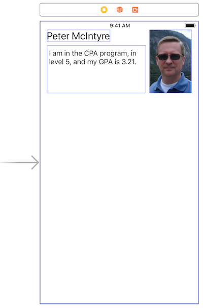
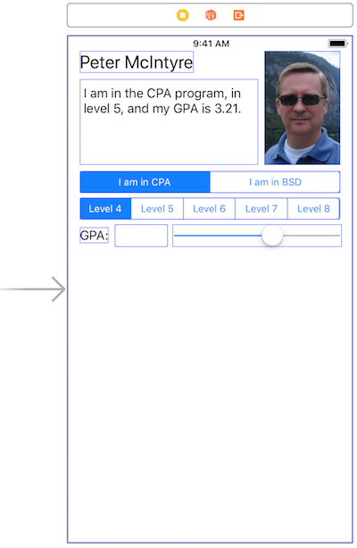
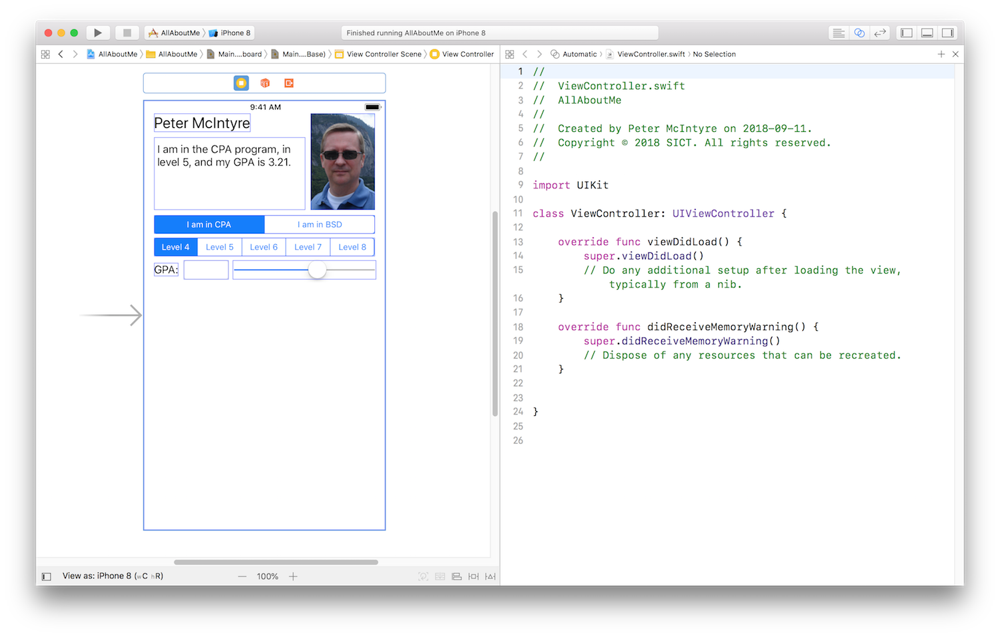

## DPS923 and MAP523 Assignment 1

Assignment 1 gets you started with iOS programming. 

Read/skim all of this document before you begin work.

While you are doing the work, if a *specific task* is not clear, or it seems to require an unreasonable amount of time to complete, contact your professor. 

<br>

### Due Date

Monday, September 24, 2018, at 11:00am ET

Grade value: 10% of your final course grade

*If you wish to submit the assignment before the due date and time, you can do that.*

<br>

### Overview and purpose

We need an iOS app that displays information about you.  

When launched, the app displays current up-to-date information about you, including your name, photo, program of study, current level of enrolment, and grade point average. The app will also enable you to change some of the displayed information.

From a programming perspective, working on the app enables you to use a number of user interface elements, work with the on-screen keyboard, and perform simple data round trips and type conversions.

<br>

### Getting started

Create a new iOS app, using the Single View Application template. The name of the app should be "**AllAboutMe**".  

If you need guidance on this task, here are the details:
* File > New > Project
* Single View App  

On the "options" dialog...
* Product Name is AllAboutMe
* Organization Name is whatever (your name, Seneca, SICT, etc.)
* Organization Identifier, we suggest "ca.ict"
* Language is Swift
* Un-check (clear) the three checkboxes

On the file save dialog...
* Un-check (clear) the "Create Git repository..." checkbox
* Choose a location in which to save your project

On the project settings editor, choose "11.0" as the "iOS Deployment Target". That way you can edit your work on different College Macs. 

On the target settings editor, we suggest that you un-check (clear) the "Landscape Left" and "Landscape Right" checkboxes.

<br>

### Doing the work

Again, as noted above, read/skim the rest of this document before you begin work. That way you know what's coming. 

<br>

#### Photo (head shot)

Before you begin adding objects to the user interface, get a head shot photo of yourself (aka a selfie). Crop and resize it so that it is 100 pixels wide, and 150 pixels tall. It must be a PNG. Use any Mac, Windows, or online program to get this done.  

Then, add your photo to your project:  
* In the project navigator, click/select the Assets.xassets blue-coloured folder
* In the editor area, a two-panel editor appears; at the bottom of the almost-empty left-side list, click the + (plus sign), and choose "Import..."
* Navigate to the saved photo, and select it

Your photo will now be available in the Utility area's  "Media Library", and we will use it soon. 

<br>

#### Upper area of the view

In the upper area of the view controller's view, we will plan for three user interface objects:
* label - UILabel  
* text area - UITextView  
* image view - UIImageView (which is the container for your photo)  

The label will display your name.  

The text area will display a string that is built from the settings in the user interface objects in the lower area of the view.  

The image view will show your picture, and appears when you drag your photo from the media library to the design surface.  

Here's how to do these tasks:

In the project navigator, click/select the Main.storyboard item.

In the editor area, at the bottom, select the "iPhone 8" size. This is fairly important, because we want all of our user interface elements to be visible even when the on-screen keyboard appears. 

In addition to, and to match with the task above, on the upper-left area controls, click the "active scheme" and set it to "iPhone 8". 

**Add a label:** From the object library area, drag a label to the view. Double-click it, and replace the selected text with your name. Alternatively, you can use the Attributes Inspector area of the right-side utility area to do this. Make the font bigger, maybe 24.   

**Add your photo:** Select your photo from the media library area. Drag it to the upper-right area of the view. Use the blue-dashed guides to position your photo. On an iOS app, you almost NEVER position user interface objects on an edge - you should always leave a margin/border.  

**Add a text view:** Drag a text view to the view. In the Attributes inspector, un-check (clear) the "Editable" behaviour. We want this text view to be read-only, because we will programmatically add its content, which will be something like "I am in the CPA program, in level 5, and my GPA is 3.21." Make the font bigger, 17, to match the default size of a label. 

Size the objects to fit.

> Tip: Want to see the "bounds rectangles" on a view?  
> On the Editor menu, choose Canvas > Show Bounds Rectangles.  
> Each UI element will now be surrounded by its true size.  
> This should make it a bit easier to learn how to do layout.  
> Un-check the menu option to remove them from the view. 

Maybe your result will look something like the following:



<br>

At this point, run your app (Command+R), just to verify that you're making progress. 

<br>

In the middle area of the view, there will be five user interface objects:
* two segmented controls - UISegmentedControl  
* label - UILabel  
* slider - UISlider  
* text field - UITextField  

**Add a segmented control:** The top segmented control will display two segments, for two School of ICT academic programs, CPA and BSD. The initially-selected segment will be YOUR program of study. You can do this configuration in the utility area's Attributes Inspector.  

**Add another segmented control:**  The other segmented control will display five segments, for the academic program levels, 4 through 8. The initially-selected segment will be YOUR level of enrolment.  

**Add a label:** This label is simply descriptive.  

**Add a slider:** The slider will have a minimum of 2.0, and a maximum of 4.0. The initial value will be YOUR current grade point average.  

**Add a text field:** The text field will display the current value of the slider. This value will be set in your view controller code. For best results, set its "Keyboard" to "Numbers and Punctuation". And, set the "Return Key" to "Done". 

Lay out the user interface objects so that everything looks nice and aligned. Preview the result. You can run your app again, just to make sure that it appears the way you want it to. Here's an example of what you may have at this point in time:



<br>

At this point, run your app (Command+R), just to verify that you're making progress. 

<br>

#### Making connections between the user interface and our source code

Writing code for this Assignment 1 is a two-step procedure:
1. Add outlets and actions to the view controller 
2. Writing code in the view controller  
<br>

##### Add outlets and actions

As you have learned, a storyboard is a resource file that holds the user interface objects, as configured by the Interface Builder editor.  

To get programmatic access to the user interface objects, we <span style="color:#ff0000;"><em>connect</em></span> them to <span style="color:#ff0000;"><em>properties</em></span> and <span style="color:#ff0000;"><em>methods</em></span> in the view controller source code file.  

Before doing this, arrange the Xcode windows and tool areas:
- Select (to display) Main.storyboard.  
- Select (click) the "View Controller" icon in the dock at the top of the scene.  
- Open the Assistant Editor (toolbar icon, or Option+Command+return). Make sure the view controller source code file is displayed.  

Then, depending upon the width or your screen, you may want to hide the Navigator area (Command+0 (zero)) and the Utility area (Option+Command+0 (zero)).  

Finally, if the left-side storyboard editor is displaying the "document outline", you can also hide that. At bottom, click the "Hide Document Outline" button. 

Here's the result:



<br>
 
##### Making connections

For the new/beginner iOS app programmer, this next procedure can seem different from other platforms, and challenging to understand. We'll take you through, step-by-step.  

First, add connections, from the following five user interface objects, to the view controller. All will be <span style="color:#ff0000;"><em>outlets</em></span>.  

* text view - suggested name resultText  
* segmented control (first one) - suggested name programSelector  
* segmented control (second one) - suggested name levelSelector  
* slider - suggested name gpaSelector  
* text field - suggested name gpaInput  

<br>

What did we just do? We added references to our view controller, so that we can read or write (i.e. get or set) the values of the user interface objects.  

Next, we want to add more connections. They will be <span style="color:#ff0000;"><em>actions</em></span>.
* segmented control (first one) - suggested name programChanged, type is UISegmentedControl  
* segmented control (second one) - suggested name levelChanged  
* slider - suggested name gpaSelectorChanged  
* text field - suggested name gpaInputChanged  

<br>

What did we just do? We added functions (the "action" in the target-action design/coding pattern) to our view controller (the "target"). These functions will be called when the app's user interacts with a user interface object.  

If you want, add a "print" statement to the action method bodies, so that when you run the app (next), it will prove to you that you're making progress. For example:

```swift
print("program changed")
```

Run your app. Make sure there are no errors.  
<br>

#### Add a function to "update the text view"

Earlier, you learned that the text view will be used to display text similar to "I am in the CPA program, in level 5, and my GPA is 3.21."  

That text will change when a change happens in any of the four input controls (two segmented controls, slider, text field). Therefore, it makes sense to write one function to do this, and simply call the function from the action methods. 

We will write a new function that will get the current settings from the controls. Try to write the function yourself, based on the practice that you have done with a Swift playground, and string-to-from-number conversions. If you need some guidance, here is an algorithm:  

```swift
func updateResultText() {

  // Read the results from the user interface controls...

  // Get and store the program selected

  // Get and store the level selected

  // Get and store the gpa value

  // Assemble the string for the text view

}
```

<br>

Here's some commentary to get you thinking. 

```programSelector.selectedSegmentIndex``` returns an integer. The control has two segments. Segment 0 (zero) represents the CPA program. Segment 1 represents the BSD program. We suggest that you use the [Swift ternary conditional operator](https://docs.swift.org/swift-book/LanguageGuide/BasicOperators.html#ID71).

Next, make a string for the level. Segment 0 (zero) represents level 4. Segment 1 represents level 5. And so on. Therefore, the actual level is the selected segment, plus 4. 

Then, you need the GPA value. Get it from the slider control. The "value" property of the slider holds its value, and it's a float type. Therefore, the string format that you'll want to use is "%1.2f".  

Finally, assemble the string, and set it to the text view control's "text" property.  

<br>

#### Calling the "update the text view" function

When do you call the function?
* When any of the user interface controls change  
* When the view loads for the first time  

Make that happen. 

Next, look at the other code in the view controller. It has a function named viewDidLoad(). The Cocoa runtime calls this function when the view loads for the first time. Therefore, it makes sense to add a statement to the bottom of this method, which will call the "update the text view" function.  

Run your app. Make sure there are no errors.  

<br>

#### How to set the value of the GPA text field

The slider and text field work together:
* If the slider changes, the text field value should change too
* If the text field value changes, the slider should change too

When the app loads for the first time, the text field is empty. Therefore, in the viewDidLoad() function, set it to the value of the slider. Remember, the text field's "text" property is a string, and should be formatted to two decimal places.  

Next, add code to the gpaSelectorChanged function, which will do the same task.  

Finally, add code to the gpaTextChanged function. It will parse (convert) a string into a float value. Use that float value to set the gpaSelector control's value.  

Run your app. Make sure there are no errors.  

<br>

### Make the app work better

At this point in time, the app should work. However, we can make it work better. How?  
* Dismiss the keyboard when we're done with it
* Handle out-of-range or incorrect text field data  
* Ensure that the maximum value of CPA levels is 6  
* Set initial/load values programmatically  

<br>

#### Dismiss the keyboard

Recently, you learned that a text field's resignFirstResponder() function will dismiss the keyboard. You saw us use that in a button-handling function. Well, in this app, we do not have a button.  

We will now introduce you - gently - to delegation. We will add a function that will handle the on-screen keyboard's "Done" button tap. In effect, the text field is *delegating*> the responsibility of handling that event, to some new code that we write.  

There are two steps to complete:  
1. Set the text field 'delegate' property to the view controller  
2. Write code to handle an event  

On the storyboard, select the text field. Then, make a connection (press and hold Control, then click-drag-drop) to the "View Controller" icon in the dock at the top of the scene. A connection popup will appear. In the Outlets area, select "delegate".

In the view controller code, edit the class declaration to look like this:  

```swift
class ViewController: UIViewController, UITextFieldDelegate {
```
<br>

Then, add the following function:

```swift
func textFieldShouldReturn(_ textField: UITextField) -> Bool {

    // add code to do things, if necessary

    return textField.resignFirstResponder()
}
```
<br>

#### Handle out-of-range or incorrect text field data

The GPA value ranges from 2.0 to 4.0, and is shown with two decimal places.  

If the user enters incorrect data (e.g. non-numeric text or symbols), the string-to-number converter will set the value to 0.0. In that situation, reset it to the minimum GPA value, 2.0.  

If the user enters a value lower than 2, then set the value to 2.0.  

If the user enters a value higher than 4, then set the value to 4.0.  

If the user enters too many decimal places, show the value with two decimal places.  

<br>

#### Ensure that the maximum value of CPA levels is 6

If the user taps the CPA segment, and then if the current level is 7 or 8, then change/set the current level to 6. That's a property of the segmented control named "selectedSegmentIndex".  

In addition to the above, you can disable the level 7 and 8 segments, by using a function (of the segmented control) named "setEnabled()".  

Conversely, if the user taps the BSD segment, then ensure that the level 7 and 8 segments are enabled.  

<br>

#### Set initial/load values programmatically

In the viewDidLoad() method, you can set the initial values of the app programmatically, if you wish.  

Simply write statements that set the initial values to your own personal situation.  

<br>

### Testing your work

Test your work by running it on the simulator. Do this frequently and incrementally, after making any substantial changes. 

Your professor plans to introduce you to the Xcode debugger soon, and that tool may help you troubleshoot problems. 

<br>

### Reminder about academic honesty

When you are ready to submit your work, you will copy some of the code in your project to plain text files, so that the My.Seneca/Blackboard “SafeAssign” tool can do its job. The next section will tell you which files to copy.

> From the Blackboard web site:  
> SafeAssign compares submitted assignments against a set of academic papers to identify areas of overlap between the submitted assignment and existing works.

<br>

### Submitting your work

Follow these instructions to submit your work, before the due date and time:  

1. Locate your **AllAboutMe** project folder in Finder (and we suggest that you make a copy of it for yourself).

2. In that folder, add a new folder named "MyCode".

3. Copy these source code files to the "MyCode" folder:  
**ViewController.swift**  
**Main.storyboard**  
For each of these files, change the file name extension to "txt".

4. Right-click the folder, and choose **Compress “AllAboutMe”**, which creates a zip file (make sure the zip file is fairly small, around 500KB or less).  

5. Login to Blackboard/My.Seneca, and in this course's Assignments area, look for the upload link, and submit your work there.  

<br>
