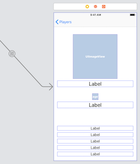

## DPS923 and MAP523 Assignment 2

Assignment 2 enables you to create a multi-view navigation-style app, with many levels of navigation (list, detail, add item). Also enables you to get hands-on experience with the iOS table view infrastructure, and introduces you to models, the "M" part of the MVC pattern. 

Read/skim all of this document before you begin work.

While you are doing the work, if a *specific task* is not clear, or it seems to require an unreasonable amount of time to complete, contact your professor. 

<br>

### Due Date

Wednesday, October 10, 2018, at 11:00pm ET  
<span style="background-color: yellow">This is a change from the original plan<br>You have until the end of Wednesday evening to complete the assignment</span>  
Grade value: 10% of your final course grade

*If you wish to submit the assignment before the due date and time, you can do that.*

<br>

### Overview and purpose

We need an app that will display performance information for quarterbacks in the current 2018 season in the National Football League.  

The app’s first view will be a table view, showing a list of quarterback names. Two more views will be available. One view will show *personal info* about the player, while the other will show *performance-related info*. 

The following shows the navigation path from the list to the first "personal info" view. 


<br>

The following shows the navigation path from the list to the "performance info" view. 


<br>

### Getting started

Create a new iOS app, using the Single View Application template. The name of the app should be "**Players**".  

On the project settings editor, choose "11.0" as the "iOS Deployment Target". That way you can edit your work on other College Macs. 

On the target settings editor, we suggest that you un-check (clear) the "Landscape Left" and "Landscape Right" checkboxes. The app will work only for portrait mode. 

> The first part of the setup will be similar to what was demonstrated in the September 26 class. 

<br>

#### Replace the view controller and scene

The template-provided view controller and scene cannot be used in this app. Therefore, in the project navigator, delete the `ViewController.swift` file. 

Next, select the "Players" folder item near the top of the project navigator, and create a new file (Command-N). It will be a Cocoa Touch Class. Next, make it a subclass of UITableViewController. 

In our September 26 classroom session, your professor suggested that the names of your controllers do not need the words "table" or "view". Here, we go further - there's no point in the word "controller" in the file or class name, so just keep it simple - we want to control a list of players, so let's just name it "PlayerList". 


<br>

Show the storyboard. Delete the existing scene. 

From the library, add a new table view controller:
* On its identity inspector, set its class to what we just created above (PlayerList)  
* Embed this controller in a navigation controller (use the Editor menu)

Select the just-added navigation controller. On its attributes inspector, check (select/mark) the "Is Initial View Controller" checkbox.

On the document outline, in the table view controller hierarchy, select the "Navigation Item". On its attributes inspector, enter a value for the Title property (maybe "Players").

At this point, the app should successfully build, and show an empty list. 

<br>

### Doing the work, table view

Again, as noted above, read/skim the rest of this document before you begin work. That way you know what's coming. 

<br>

#### Data and model classes for the app

Your professor has extracted player and performance data of quarterbacks from the National Football League (NFL) public web site. There are two collections:
1. QBInfo - Personal data, including name, physical info, birthplace, and so on 
2. QBPerf - Performance data, including the statistics that are commonly used to assess performance

Player photos and team logos have also been extracted. All content has been packaged in a zip file that you can get from the Blackboard/My.Seneca Assignment 2 upload link, or from here:

[Click here to download the zip file](a2-assets-v2.zip)

> Important note:  
> If you downloaded the zip file before 5:00pm on  
> Tuesday, October 2, then you must do so again.  
> A data type problem was discovered, and corrected.  
> In the QBPerf and QBPerfManager classes, the "Float"  
> data types were changed to "Double".  
> So, after you get the new version, replace the files  
> QBPerf.swift and QBPerfManager.swift

> Alternatively, edit your existing source code.  
> Xcode has a nice "edit all in scope" feature,  
> that will edit all matching strings in one task.  
> If you're interested, here's how to do it:  
> 1. Open the source code file (e.g. QBPerf.swift)  
> 2. Click one of the "Float" words.  
> 3. Press Control+Command+E, and you will notice all are highlighted  
> 4. Replace "Float" with "Double"; press Enter when done 

<br>

After unzipping, copy the contents into your project. There are at least two ways to do this:  
1. Drag-and-drop from Finder into the project navigator  
2. In project navigator, on the yellow folder, right-click and "Add files to..." 

For both ways, ensure that you choose the "copy files" setting. 

The data is located in the "plist" files (QBInfo.plist and QBPerf.plist). The unique identifier (or key) for each data file is the value in the `playerName` key-value pair.

Data model class source code files are included (QBInfo.swift and QBPerf.swift), and each describes the shape of each entity. 

The other source code files (QBInfoManager.swift and QBPerfManager.swift) hold data *manager* classes. Each data manager has a public property (sharedManager) that can be used as a reference in any view controller. Each also has a public method (allQBInfos() or allQBPerfs()) that returns an array with the requested objects (i.e. an array of QBInfo objects, or an array of QBPerf objects). 

To use the data in any view controller, follow this pattern:

```swift
// Create these instance variables...

// Get a reference to the data manager
let mInfo = QBInfoManager.sharedManager

// Create a local collection to hold the data
var qbInfo: [QBInfo] = []

// Then, in viewDidLoad(), fetch the data 
qbInfo = mInfo.allQBInfos()

// At this point in time, the qbInfo array will have
// all the player personal info, ready for display
```

<br>

#### Show data on the table view

At this point in time, the following tasks have been done:
* Table view controller code file was created
* Table view scene was created on the storyboard
* Data for the app was added to the project

We're ready to show data on the table view. Follow the guidance (textbook, classroom) to enable this to happen. Here's a brief listing of the tasks to be done:

* On the storyboard, configure the table view scene's prototype cell with a value for the reuse identifier, and then edit its controller code to match. 

* The prototype cell style should be "Subtitle", so that we can show two lines of text. 

* The table view will allow TWO kinds of navigation (detail, and disclosure), so configure its accessory as "Detail Disclosure". 

* In the controller code, set the return value for the "number of sections" method to 1. 

* Set the return value for the "number of rows" to the count of items in the array (which is the data source). 

* Configure the cell's text content. Use this guidance:

```swift
// Using the current row value, get a reference 
// to the desired item in the array (data source)

// Set the text of the cell's text label to the player's name
// Set the detail text label to the team name
```

Before continuing, study the data. Notice the format of the player names. (For example, Ryan Fitzpatrick.) 

Next, study the player photos (either in the asset catalog or in Finder). Notice the format of the photo file names. (For example, `a2-ryan-fizpatrick`. FYI, all begin with "a2-". And, all are "png" files.)

It should be clear to you that the name of each photo uses the player's name. In the next task, you will configure the cell's image content, and you will need to specify an image name. You must transform the player name string into a string that matches the expected image name format. To do this, you will learn a few Swift string methods. Let's continue with the task list:

* Configure the cell's image content. Use this guidance:

```swift
// Create a local string variable to hold the photo file name 

// Append the player name to the string
// https://developer.apple.com/documentation/swift/string/1641225-append

// Replace the space with a dash
// https://developer.apple.com/documentation/foundation/nsstring/1412937-replacingoccurrences

// Transform the string to lower case
// https://developer.apple.com/documentation/swift/string/1641392-lowercased

// Append the filename's extension (.png)
// At this point, the string should be complete
// For example, a2-ryan-fizpatrick.png

// Set the image property of the cell's image view 
// by using the UIImage(named:) method, e.g. 
// ... UIImage(named: playerPhotoName)
```

<br> 

At this point in time, your app should display the data as a list of players in the table view.


<br>

### Adding other controllers and scenes

Before continuing, ensure that your app will display the list of players. 

<br>

#### Detail controller and scene

Add and configure a DETAIL controller and scene. 

Reminder, this will appear only when a user taps the &#9432; detail accessory. 

> Follow the guidance in [this document](/topics/how-to-nav-detail) to complete this task. 

What should appear on the view? All data from the QBInfo object, except for the values in the "rank" and "teamCode" properties. As suggested by the sample screen capture, show the player's photo in a suitable size. Use the value of the "teamCode" property to show the team icon. 



<br>

#### Disclosure controller and scene

Add and configure a DISCLOSURE controller and scene.

Reminder, this will appear when a user taps anywhere on a row (except on a detail accessory, if present). 

> Follow the guidance in [this document](/topics/how-to-nav-disclosure) to complete this task. 

What should appear in the view? All data from the QBInfo object, except for the values in the "rank" and "teamCode" properties. As suggested by the sample screen capture, show the player's photo in a suitable size. Use the value of the "teamCode" property to show the team icon. You must provide the string values for the rest of the data. (Tip: Use Swift string interpolation.)


<br>

### Testing your work

Test your work by running it on the simulator. Do this frequently and incrementally, after making any substantial changes. 

Your professor plans to introduce you to the Xcode debugger soon, and that tool may help you troubleshoot problems. 

<br>

### Reminder about academic honesty

When you are ready to submit your work, you will copy some of the code in your project to plain text files, so that the My.Seneca/Blackboard “SafeAssign” tool can do its job. The next section will tell you which files to copy.

> From the Blackboard web site:  
> SafeAssign compares submitted assignments against a set of academic papers to identify areas of overlap between the submitted assignment and existing works.

<br>

### Submitting your work

Follow these instructions to submit your work, before the due date and time:  

1. Locate your projectfolder in Finder (and we suggest that you make a copy of it for yourself).

2. In that folder, add a new folder named "MyCode".

3. Copy these source code files to the "MyCode" folder:  
**Main.storyboard**  
**Your table view controller**
**The "detail" view controller**
**The "performance" view controller**
For each of these files, change the file name extension to "txt".

4. Right-click the folder, and choose **Compress “xxxxxxxx”**, which creates a zip file.  

5. Login to Blackboard/My.Seneca, and in this course's Assignments area, look for the upload link, and submit your work there.  

<br>
