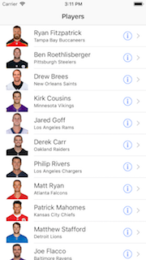
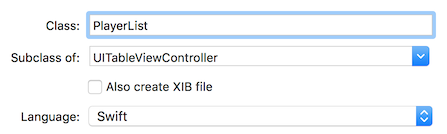

## DPS923 and MAP523 Assignment 2

Assignment 2 enables you to create a multi-view navigation-style app, with many levels of navigation (list, detail, add item). Also enables you to get hands-on experience with the iOS table view infrastructure, and introduces you to models, the "M" part of the MVC pattern. 

<p style="color: red;"><span>This document is being edited.<br>This notice will be removed when the edits are complete.</span></p>

Read/skim all of this document before you begin work.

While you are doing the work, if a *specific task* is not clear, or it seems to require an unreasonable amount of time to complete, contact your professor. 

<br>

### Due Date

Monday, October 8, 2018, at 11:00am ET  
Grade value: 10% of your final course grade

*If you wish to submit the assignment before the due date and time, you can do that.*

<br>

### Overview and purpose

We need an app that will display performance information for quarterbacks in the current 2018 season in the National Football League.  

The app’s first view will be a table view, showing a list of quarterback names. Two "detail" views will be available. One will show info about the player, while the other will show performance-related information. The app also allows the user to update performance data, by entering new values after a game finishes. 

The following shows the navigation path from the list to the "info" view. 

&nbsp;&nbsp;&nbsp;&nbsp;&nbsp;

<br>

The following shows the navigation path from the list to the "performance" view. 

> To be posted

<br>

### Getting started

Create a new iOS app, using the Single View Application template. The name of the app should be "**Players**".  

On the project settings editor, choose "11.0" as the "iOS Deployment Target". That way you can edit your work on different College Macs. 

On the target settings editor, we suggest that you un-check (clear) the "Landscape Left" and "Landscape Right" checkboxes. The app will work only for portrait mode. 

> The first part of the setup will be similar to what was demonstrated in the September 26 class. 

<br>

#### Replace the view controller and scene

The template-provided view controller and scene cannot be used in this app. Therefore, in the project navigator, delete the ```ViewController.swift``` file. 

Next, select the "Players" folder item near the top of the project navigator, and create a new file (Command-N). It will be a subclass of UITableViewController. In class, your professor suggested that the names of your controllers do not need the words "table" or "view". Here, we go further - there's no point in the word "controller" in the file or class name, so just keep it simple - we want to control a list of players, so let's just name it "PlayerList". 



<br>

Show the storyboard. Delete the existing scene. 

From the library, add a new table view controller:
* On its identity inspector, set its class to what we just created above (PlayerList)
* Embed this controller in a navigation controller (use the Editor menu)

Select the navigation controller:
* On its attributes inspector, check (select/mark) the "Is Initial View Controller" checkbox

On the document outline, in the table view controller hierarchy, select the "Navigation Item":
* On its attributes inspector, enter a value for the Title property (maybe "Players") 

At this point, the app should successfully build, and show an empty list. 

<br>

### Doing the work

Again, as noted above, read/skim the rest of this document before you begin work. That way you know what's coming. 

<br>

#### Data and model classes for the app

Your professor has extracted player info and performance data of quarterbacks from the National Football League (NFL) public web site. There are two collections:
1. Player info, including name, physical info, birthplace, and so on 
2. Player performance data, including the statistics that are commonly used to assess performance

Player photos and team logos have also been extracted. All content has been packaged in a zip file that you can get from the Blackboard/My.Seneca Assignment 2 upload link, or from here:

[Click here to download the zip file](a2-assets.zip)

<br>

<br>
<br>
<br>
**more to come**
<br>
<br>
<br>


Layout  
Add item  
Calculations (including [passer rating](https://en.wikipedia.org/wiki/Passer_rating))

<br>

<br>

### Testing your work

Test your work by running it on the simulator. Do this frequently and incrementally, after making any substantial changes. 

Your professor plans to introduce you to the Xcode debugger soon, and that tool may help you troubleshoot problems. 

<br>

### Reminder about academic honesty

When you are ready to submit your work, you will copy some of the code in your project to plain text files, so that the My.Seneca/Blackboard “SafeAssign” tool can do its job. The next section will tell you which files to copy.

> From the Blackboard web site:  
> SafeAssign compares submitted assignments against a set of academic papers to identify areas of overlap between the submitted assignment and existing works.

<br>

### Submitting your work

Follow these instructions to submit your work, before the due date and time:  

1. Locate your projectfolder in Finder (and we suggest that you make a copy of it for yourself).

2. In that folder, add a new folder named "MyCode".

3. Copy these source code files to the "MyCode" folder:  
**Main.storyboard**  
( more to come )  
For each of these files, change the file name extension to "txt".

4. Right-click the folder, and choose **Compress “xxxxxxxx”**, which creates a zip file.  

5. Login to Blackboard/My.Seneca, and in this course's Assignments area, look for the upload link, and submit your work there.  

<br>
