## DPS923 and MAP523 Assignment 3

Assignment 3 builds upon the multi-view navigation-style app idea, by adding coverage of recently-covered topics. 

Read/skim all of this document before you begin work.

While you are doing the work, if a *specific task* is not clear, or it seems to require an unreasonable amount of time to complete, contact your professor. 

<br>

### Due Date

Wednesday, November 7, 2018, at 11:00pm ET  
Grade value: 10% of your final course grade

*If you wish to submit the assignment before the due date and time, you can do that.*

<br>

### Overview and purpose

We need an app that will work with data about Canada's provinces and cities. 

The app's first scene is a list of provinces. The data model manager's initializer code creates two provinces. 

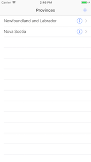

<br>

Tapping on the `+` "add" (upper-right) button will modally present an "Add Province" scene.

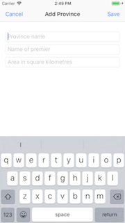

<br>

Back on the province list, tapping a province's &#9432; detail accessory shows more detail.

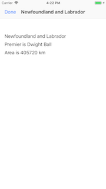

<br>

Alternatively, tapping elsewhere on the row will show the next scene, which is a list of cities in the tapped/selected province.

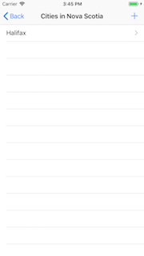

<br>

There is a similar workflow for cities (in a province). We'll discuss that later. 

<br>

### Getting started

Create a new single-view project named "Canada". Set the iOS version for deployment at 11.0, and the active scheme for the desired emulated device etc. 

Building the project will probably be easier if you use the code assets in the template (version 1). The how-to instructions below will mostly assume that you are using the template. (If you don't use the template, you will just have to write more code and fill in the gaps a bit more.)

Run the app to prove that it works, before doing any changes. Then, as you make changes, build frequently to ensure there are no errors. 

<br>

### Doing the work, data model classes

Again, as noted above, read/skim the rest of this document before you begin work. That way you know what's coming. 

Let's create and configure the app's data. Add these source code files to the project:
* DataModelClasses.swift
* DataModelManager.swift

Create two new data model classes. Follow the pattern of the existing "Product" class to code the properties and the initializer.

Add at least the following properties to a new "Province" class:
* identifier, integer
* province name, string
* name of the premier, string
* area in square kilometres, integer

Add at least the following properties to a new "City" class:
* identifier, integer
* city name, string
* name of the mayor, string
* population, integer

Before continuing, write the initializers for each class. 

How do we "link" the two classes together? In a way that's similar to other languages, and therefore should be familiar to you. A province can have a collection of cities. Looking the other way, a city belongs to a province. 

Add an array property, of type City, to the Province class. Its initial value is an empty array. Later, when we add City objects, they will be contained within a Province object. 

We should change the City class too. For safety and convenience, it is a good idea to know what province a city belongs to. We can do that by adding an integer property for the province identifier. Yes, we will have to maintain that actively and manually. (Later, when we use a persistence management system - such as a database - some of that work will be done by the system.) Update the City class initializer to require the province identifier. 

Save, build, and run, before continuing. 

<br>

### Doing the work, data model manager

The methods in the manager class assume the use of a "Product" class. In general, follow the pattern of the existing methods, and create new methods for the "Province" class. 

<br>

#### Initializer, load, and save methods

In the initializer, write code to add data for two (2) provinces. Wikipedia is a good source of information. 

> Tip - Comment out the existing code. Then, copy and paste it, and edit the pasted code.

The save and load methods need editing too. Remember from above, our focus is on the province collection. City objects will be contained within each province object, so we do not need a separate data storage file for cities.  

Later (soon), the appropriate code will be copied into the app delegate source code file. We'll do that after the first controller is configured. 

<br>

#### Data service operation tasks (fetch, add, etc.)

Take the time now to write methods for the Province tasks. Maybe do this one method at a time, using a copy-paste and edit workflow. 

> Later (soon), we will add more code to handle city-related tasks.

Save, build, and run, before continuing. 

<br>

### Doing the work, provinces

In the project navigator, delete the "ViewController.swift". On the storyboard, delete the scene. 

Now, we can make the controller that shows a list of provinces. From the template, add the "ProductListBase.swift" source code file. 

Each controller source code file that is added from the template must be edited, to customize it to the current app and its data. Here is a general suggestion about how to make most of the edits. 

First, in the project navigator, rename the added file to better match the current app. For example, here, rename "ProductListBase.swift" to "ProvinceList.swift". 

Next, open it for editing. We will do a *find-replace*. This feature is found on the "Find" menu (and it has a keyboard shortcut, Option+Command+F). 

Turn on (activate) its case sensitivity option (the `Aa` control). It will be blue-colored when activated. 

You will typically do four separate find-replace tasks. For each click the "All" button/control do do the work:
1. Plurals, proper case - "Products" with "Provinces"
2. Plurals, lower case - "products" with "provinces"
3. Singulars, proper case - "Product" with "Province"
4. Singulars, lower case - "product" with "province"

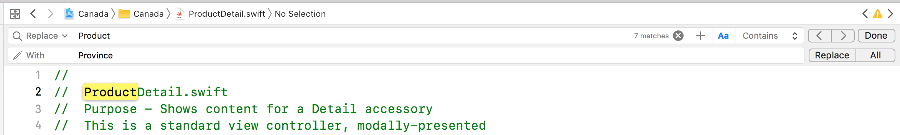

<br>

#### Data model manager and the app delegate

Now that the first controller has been added and configured, we must go back and ensure that the data model manager is initialized when the app loads for the first time. 

Located the commented-out code at the bottom of the DataModelManager.swift source code file. Select and copy the appropriate code. As its how-to instructions state, replace the existing stub method in the app delegate class with the copied code.

You can decide whether to add the "save plist" statements to the appropriate methods now, or later. 

> If you add the statements now, and load/save errors start to happen because of bad data or changes to the data structure, then you can delete the app from the simulator, and the app will re-create the data. 

<br>

#### Table view scene on the storyboard

On the storyboard, add a table view controller. Set its class to the above "ProvinceList" class. Set the cell reuse identifier of the prototype table view cell (to match the value used in the ProvinceList class). Other properties can be set/configured now or later. 

Embed this scene in a navigation controller. Set the navigation controller as the initial view controller. 

Save, build, and run, before continuing. If all goes well, your app will show a list of two provinces.


<br>

#### Add province 

From the template, add the "ProductAdd.swift" source code file. Edit (product to province) as you did before. 

The Province data model class is obviously different from the templated Product class. As a result, you must do more edits, to match the app's needs. Outlets, data validation, and calling the delegate method are the typical things that need edits. 

Notice the *example method implementations* at the bottom of the source code file. Copy those to the presenting controller class (ProvinceList), and ensure that the ProvinceList class adopts the AddProvinceDelegate protocol. 

While you're still editing ProvinceList, activate (uncomment) the code that handles the "toProvinceAdd" segue. 

Now, do the storyboard work:
1. Add a standard view controller scene, set its properties
2. Embed it in a navigation controller
3. On the view controller scene, add input controls (text fields etc.) that meet the needs of the controller, and connect them to outlets in the controller code
4. Add "Cancel" and "Save" buttons, and connect them to the actions in the controller code
5. On the table view controller scene (province list), add a bar button to the right side of the nav item area; set its System Item to "Add" 
6. Connect this new bar button to the nav controller scene of the province add controller/scene. It will be an "Action Segue", set to "Present Modally"; the segue identifier will match the value in the segue method in the ProvinceList class (probably something like "toProvinceAdd")

At this point, your storyboard may look something like the following. (Click the image, and any other storyboard image that follows, to open it full-size in a new tab/window.) Notice the add province scene in the upper-right area of the image. 

<a href="images/a3-storyboard-v2.png" target="_blank">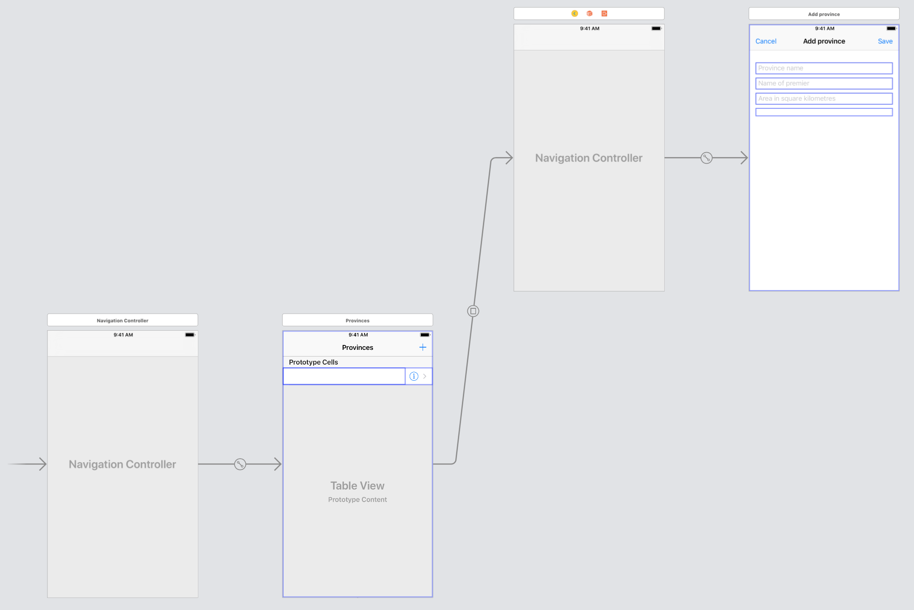</a>

<br>

Save, build, and run, before continuing. The app should now enable the user to create new provinces. 

<br>

#### Province detail

Let's code the ability to see full details about a province. 

From the template, add the "ProductDetail.swift" source code file. Edit (product to province) as you did before. 

Similar to before, some edits are needed. Outlets, viewDidLoad(), and calling the delegate method are the typical things that need edits. 

Again, notice the *example method implementations* at the bottom of the source code file. Copy those to the presenting controller class (ProvinceList), and ensure that the ProvinceList class adopts the ShowProvinceDetailDelegate protocol. 

While you're still editing ProvinceList, activate (uncomment) the code that handles the "toProvinceDetail" segue. 

Now, do the storyboard work:
1. Add a standard view controller scene, set its properties
2. Embed it in a navigation controller
3. On the view controller scene, add display controls (labels etc.) that meet the needs of the controller, and connect them to outlets in the controller code
4. Add a "Done" button to the left side, and connect it to the action in the controller code
5. On the table view controller scene (province list), configure the cell prototype accessory to "Detail Disclosure" 
6. Connect the prototype cell to the nav controller scene of the province detail controller/scene. It will be an "Accessory Action", set to "Present Modally"; the segue identifier will match the value in the segue method in the ProvinceList class (probably something like "toProvinceDetail")

<a href="images/a3-storyboard-v3.png" target="_blank">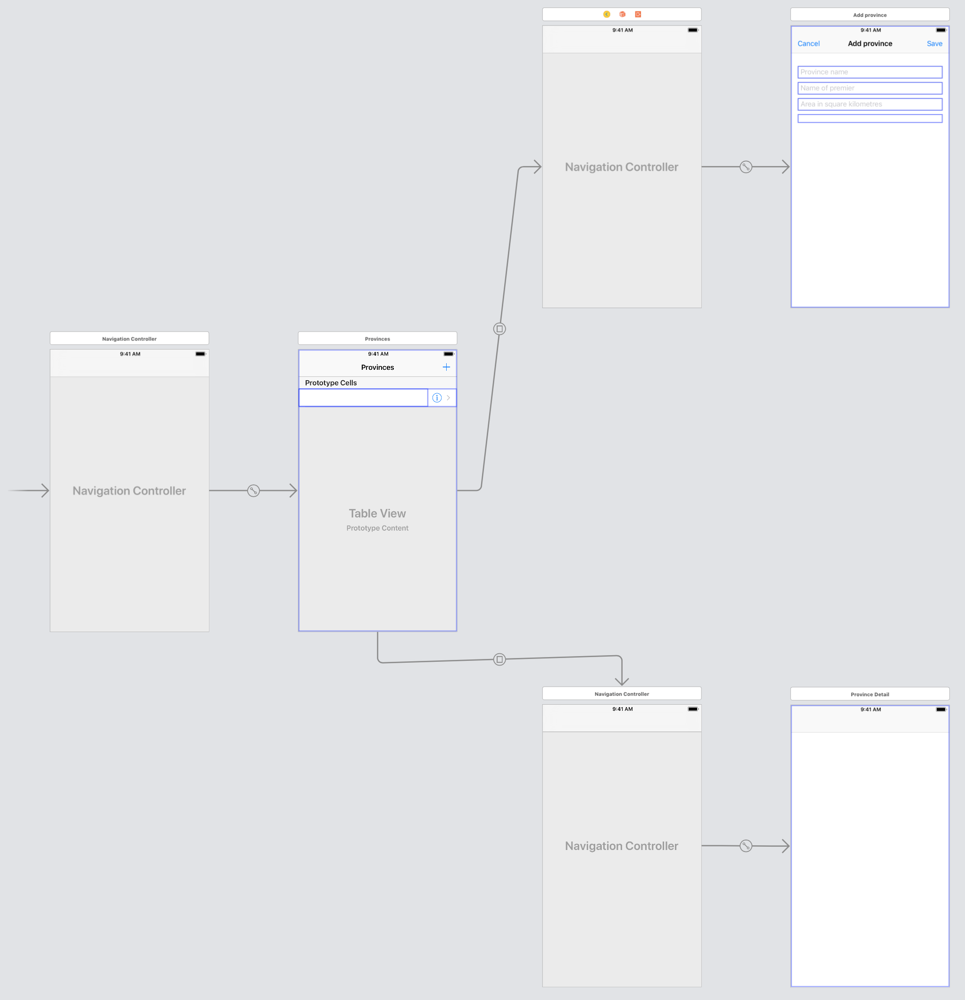</a>

<br>

Save, build, and run, before continuing. The app should now enable the user to view province detail. 

<br>

### Doing the work, cities in a province

Province-related work (list, add, detail) is mostly done. Now, we will do similar work for cities. 

A descriptive overview of the next few sections is as follows: 
* The app's first or root controller is a list of provinces 
* Tapping on a province will segue to a LIST of cities WITHIN that tapped/selected province 
* Similar to above, the list of cities will support an "add" scene and segue
* It will also support a standard "next in workflow" scene and segue that will show info/content about the tapped/selected city (it will NOT support a "detail" scene)

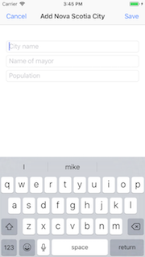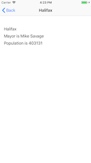

<br>

The work done to assemble this nav flow will be similar to what you just did with provinces. The difference is the data. When we are working with a list of cities, it is a collection of City objects located in a specific Province object. We must ensure that the data model manager methods accommodate this difference. 

> Tip - Draw a simple diagram that shows the containment or nesting of a small collection of city objects inside a province object. That will help you visualize the data storage scheme. And it will help you plan to write code. 

<br>

#### Data model manager support for cities

We do not change the existing initializer, load, and save methods. They are good as-is. 

We do need data service methods to support these requests:
1. Fetch all city objects (i.e. a collection) for a specific province 
2. Sort all city objects by identifier for a specific province
3. Sort all city objects by name for a specific province
4. Fetch one city object for a specific province
5. Add new city object for a specific province

Notice that all of these requests are "for a specific province"? That means that *ALL* these methods *MUST* have another argument that accepts the province identifier. Then, in the method body, the identifier will typically be used to fetch the province object, before doing the main task (fetch city/cities, sort, add). 

> Don't forget this - all the city-related methods need an argument that accepts the province identifier. 

Here's some guidance for specific methods.

**nextCityId**  
Fetch the desired province object.  
The return function does its work (reduce) on the cities collection of the province object. 

**cityById**  
Consider wrapping this logic in an `if-let` statement.  
Fetch the desired province object.  
The return function does its work (find where) on the cities collection of the province object. Here's some pseudocode:  
```swift
func cityById( arguments ) -> City? {
  if let province = provinceById ( value ) {
    // do stuff, and return the city object
    return the result
  }
  // If the above statement fails, we return nil, which is appropriate
  return nil
}
```

**cityAdd**  
Again, consider wrapping this logic in an `if-let` statement.  
Fetch the desired province object.  
Validate the incoming data.  
If good, finish configuring the new city item object.  
Save it to the provinces collection of cities.  
Return the just-added city object.  

**citiesSortedById** and **citiesSortedByName**  
Again, `if-let`... (if it fails, return an empty array).  
Fetch the desired province object.  
The return function does its work (sorted) on the cities collection of the province object.  

<br>

### City list controller and scene

Remember, this will appear when a province is tapped/selected. The ProvinceList controller will pass on the province object to a new CityList controller. The CityList controller will render/display the contents of the province object's *cities* property, which is an array of zero or more city objects.  

From the template, add the "ProductListBase.swift" source code file. Rename it to CityList.swift. Then find-replace edit the contents. (Use proper English spelling - the plural of "city" is obviously "cities".)

Change the other code (including the code in the `tableView(_:cellForRowAt:)` method) to work properly. 

This city list controller will support two segues. One will be a next/workflow segue, and the other will be an add segue. Add those segue handlers now too. 

<br>

#### City list scene configuration

On the storyboard, add a table view controller/scene, and set its identity. Set its prototype cell to have a disclosure accessory, and set its reuse identifier. 

Make a segue from the prototype cell in the province list scene to this new city list scene. It is a "Selection Segue", "Show". 

Save, build, and run, before continuing. The app should now enable the user to tap/select a province, and navigate to an empty list of cities (for that province). 


<br>

### Add city controller and scene

From the template, add the "ProductAdd.swift" source code file. Edit (product to city) as you did before. 

Remember to adopt the "add city" protocol in the city list controller, and copy-paste the *example method implementations*.

While you're still editing CityList, activate (uncomment) the code that handles the "toCityAdd" segue. 

Now, do the storyboard work (same list of six tasks that you did above for "add province"). However, BEFORE you do, there is one more special thing that you must do - otherwise task 5 (adding a `+` "Add" bar button) will not work. Do this:
* On the storyboard, show the city list scene 
* In the object browser, look for a "Navigation Item"
* Drag it on top (anywhere) of the city list scene (as you do this, notice a symbol `<` appears near the cursor)


<br>

At this point, your storyboard may look something like the following. Notice the city list scene (in the middle) with the `+` bar button item. Notice also its segue to the "add city" scene in the lower-right area of the image. 

<a href="images/a3-storyboard-v4.png" target="_blank">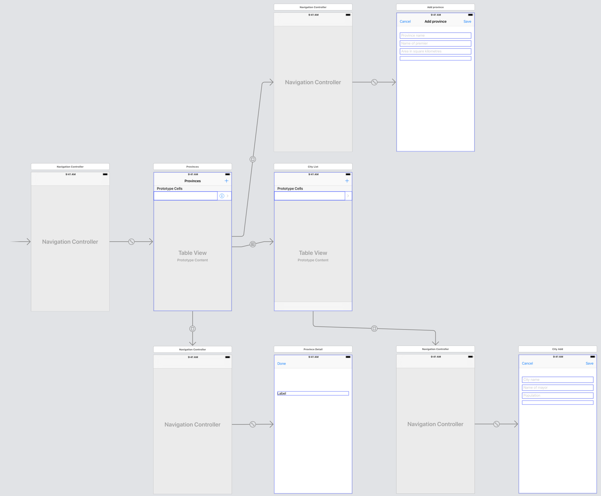</a>

<br>

Save, build, and run, before continuing. The app should now enable the user to add a new city (for a specific province).

<br>

### View city info controller and scene

The last feature is to support a user tapping/selecting a row on the city list, and navigating to a standard view that shows the city's information. 

From the template, add the "ProductSceneBase.swift" source code file. Edit (product to city) as you did before, and the other typical things (outlets etc.). 

In CityList, activate (uncomment) the code that handles the "toCityScene" segue. 

Now, do the storyboard work:
1. Add a standard view controller scene, set its properties
2. On the view controller scene, add display controls (labels etc.) that meet the needs of the controller, and connect them to outlets in the controller code


<br>

At this point, your storyboard may look something like the following. Notice the new city info scene (in the middle-right area of the image). 

<a href="images/a3-storyboard-v6.png" target="_blank">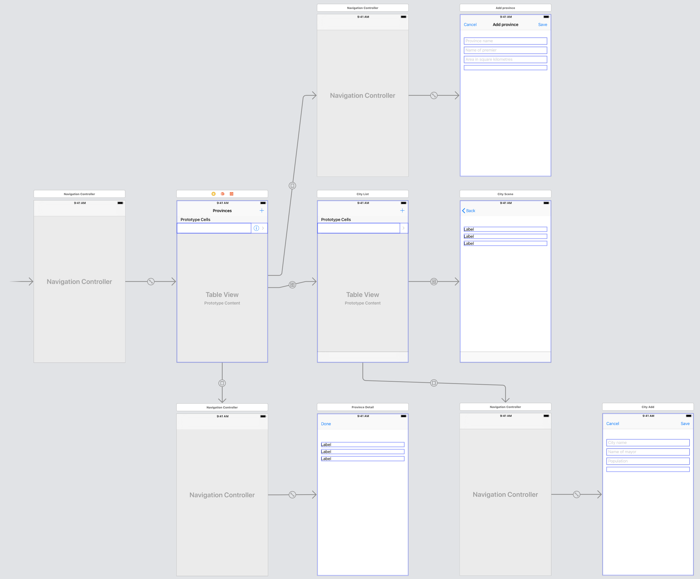</a>

<br>

Save, build, and run, before continuing. The app should now enable the user to view info about a city.

<br>

### Testing your work

Test your work by running it on the simulator. Do this frequently and incrementally, after making any substantial changes. Use the debug tool when it's useful to do so.

<br>

### Reminder about academic honesty

When you are ready to submit your work, you will copy some of the code in your project to plain text files, so that the My.Seneca/Blackboard “SafeAssign” tool can do its job. The next section will tell you which files to copy.

> From the Blackboard web site:  
> SafeAssign compares submitted assignments against a set of academic papers to identify areas of overlap between the submitted assignment and existing works.

<br>

### Submitting your work

Follow these instructions to submit your work, before the due date and time:  

1. Locate your project folder in Finder (and we suggest that you make a copy of it for yourself).

2. In that folder, add a new folder named "MyCode".

3. Copy these source code files to the "MyCode" folder:  
**Main.storyboard**  
**DataModelClasses.swift**  
**DataModelManager.swift**  
**ProvinceList.swift**  
**ProvinceAdd.swift**  
**CityList.swift**  
**CityAdd.swift**  
For each of these files, change the file name extension to "txt".

4. Right-click the folder, and choose **Compress “xxxxxxxx”**, which creates a zip file.  

5. Login to Blackboard/My.Seneca, and in this course's Assignments area, look for the upload link, and submit your work there.  

<br>
