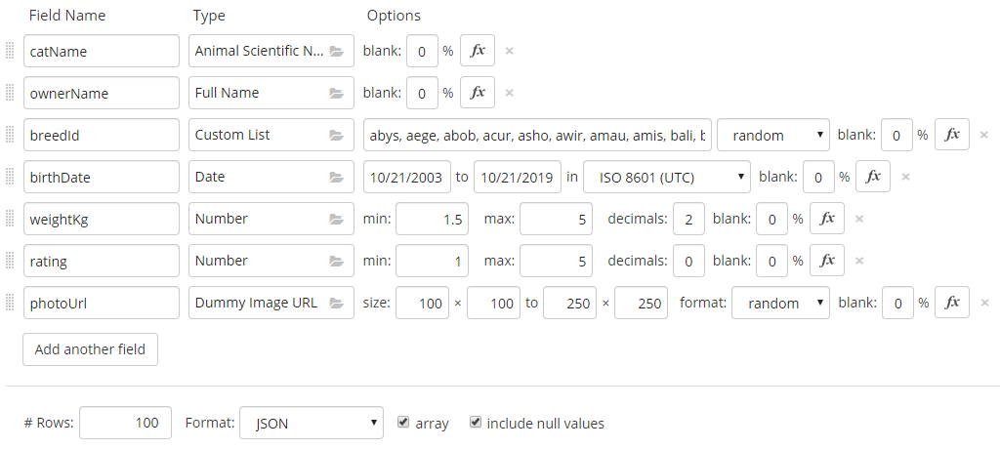
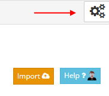
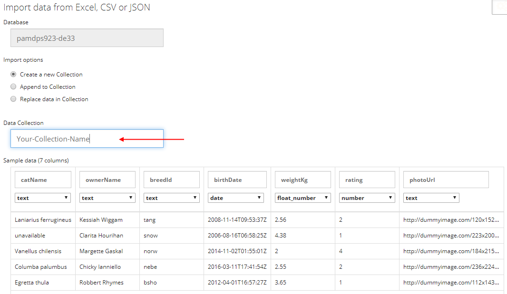
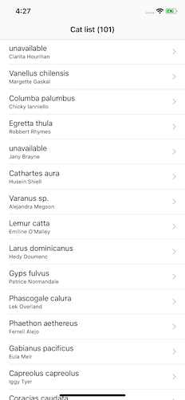
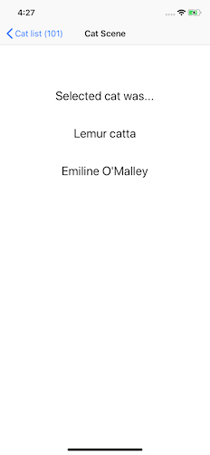
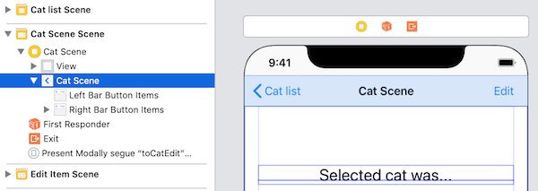
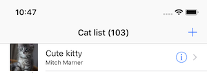

## DPS923 and MAP523 Assignment 3

Assignment 3 enables you to show how to use the network in an iOS app. 

Read/skim all of this document before you begin work.

While you are doing the work, if a *specific task* is not clear, or it seems to require an unreasonable amount of time to complete, contact your professor. 

<br>

### Due Date

Monday, March 2, 2020, at 11:00pm ET  
Grade value: 14% of your final course grade

*If you wish to submit the assignment before the due date and time, you can do that.*

<br>

### Overview and purpose

The app will let the user maintain information about lovable cats &#128049; &#128008; that are owned by you, your family, and friends. The app's data is stored on a web API that you will create. 

> Cats?  
> Yes, cats. Long before the web devolved into a space filled with like-seeking 'gram-ers and surly commenters, its primary role was as a cat photo and delivery platform.  
> Ha ha, just kidding. 

Here are the point-form specifications (which will be expanded on in the sections that follow). 

It's a multi-scene app:
* List of cats 
* Cat info scene (disclosure accessory)
* Detail scene (detail accessory)
* Add a new cat
* Edit an existing cat

Also, the app: 
* Has a navigation interface
* And a data model, implemented using best practices 
* And is deployed to an iOS device 

> DPS923 students will have a few additional specifications. 

<br>

### Getting started, web API

Your professor has discovered a very nice and useful service: **[restdb.io](https://restdb.io)**

> From its web site...  
> restdb.io is probably the easiest online NoSQL database backend for web and serverless applications. Model your information quickly. The data management application, schema and REST API are instantly available.

For small projects (like this one), it is free to use. 

Each student will:
1. Sign up for a restdb.io account 
2. Generate data using mockaroo.com 
3. Import the data into a new restdb.io database collection

Your Assignment 3 app will use the result as its web API. 

<br>

#### Sign up for a restdb.io account

Visit [restdb.io](https://restdb.io), and [sign up](https://restdb.io/signup) for an account. It doesn't matter what option you choose (Google, Facebook, email), just pick one that will be convenient for you. 

After login, it will probably show you a list of your databases, which will be empty. 

<br>

#### Generate data using mockaroo.com 

The app needs some starter data. Visit [mockaroo.com](https://mockaroo.com). 

We need a variety of data types. Configure the setup screen so that it is similar to the example shown below. (Click/tap to open it full-size in a new tab/window.)

<a href="images/a3-mockaroo-data-v1.png" target="_blank"></a>

Here are a few comments about the data and its setup:

The "breedId" is a string (text) value that holds a cat breed identifier. The possible values are specified by another web API, [TheCatAPI](https://thecatapi.com). Here they are - copy the string below into the Mockaroo "Custom List" text field:

```text
abys, aege, abob, acur, asho, awir, amau, amis, bali, bamb, beng, birm, bomb, bslo, bsho, bure, buri, cspa, ctif, char, chau, chee, csho, crex, cymr, cypr, drex, dons, lihu, emau, ebur, esho, hbro, hima, jbob, java, khao, kora, kuri, lape, mcoo, mala, manx, munc, nebe, norw, ocic, orie, pers, pixi, raga, ragd, rblu, sava, sfol, srex, siam, sibe, sing, snow, soma, sphy, tonk, toyg, tang, tvan, ycho
```

Notice that "weightKg" and "rating" are numbers, but the first one has decimal places. We want to work with this difference in our app. 

The "photoUrl" field will get a placeholder (dummy) image URL, but our app will allow it to be updated by a URL to a real cat photo. 

Generate and save between 50 and 100 rows of data. 

<br>

#### Import the data into a new restdb.io database collection

Return to the restdb.io app. Create a new database. You can use this database for Assignment 3, and maybe Assignment 4. 

We suggest that you choose a "Name" that combines *your name initials* and *the course code*. The "Create New Database" task will then add a four-character suffix to the database name. For example, your professor's name initials are "RA", so the database was named `radps923-de33`. 

After creation, click its name on the left side of the list, and the database manager screen appears. Enable "Developer Mode", by clicking on the gear icon in the upper-right area of the screen.



A multi-panel screen appears. The "Resources" tab shows the list of collections in the database (and the collections on the list are internal system-level collections for use by the database manager itself). 

Notice the "Import" button on the right side - click that. Then drag the Mockaroo-generated JSON file into the drop target area. Click the "Upload" button, and it will attempt to read the data. If successful, it will show the results. (Click/tap to open it full-size in a new tab/window.)

<a href="images/a3-restdbio-create-collection-import.png" target="_blank"></a>

Decide on and enter a collection name (e.g. a3cats). (The collection name will obviously appear in the URLs to the web API.) Complete the task, and it now appears at (or near) the top of the list on the "Resources" tab. 

<br>

#### Generate an "API key"

Every request to the web API must include an "API key". Therefore, generate one, and be prepared to use it in your app (and in the Postman app during testing). 

Click the "API keys" tab, then the "Manage API-keys" button. Add a new "Web page API keys (CORS)". In its dialog, enter a description that's meaningful to you. Then, choose to enable all of the "REST methods". Save, and it will generate a 24-character key. 

Every request will must include a custom header named `x-apikey`, and the value will be the generated API key. 

<br>

#### Test the result, and study the URL patterns

Use the Postman app. Test all of the typical requests:
* Get all
* Get one by its identifier
* Add new
* Edit existing
* Delete item

DO NOT continue until you have successfully tested these typical responses. If they don't work in Postman, they obviously won't work in your app. 

<br>

### Getting started, iOS app

Create a new iOS app, using the Single View Application template. The name of the app should be "**ILoveCats**".  

Follow best practices about project creation. Ask if you are unsure. 

<br>

### Doing the work

Again, as noted above, read/skim the rest of this document before you begin work. That way you know what's coming. 

Follow best practices and recommended guidance in all parts of your work. 

Test your work incrementally. Do one small task, and then test it to ensure that it works, before continuing. 

> DPS923 students will have a few additional specifications. 

<br>

#### Getting started

Get started by assembling a two-scene app with a navigation interface. The first scene will be a list, and the second will be a drill-down (workflow) scene that shows info about the selected list item. 

You'll need the usual bits:
* Scenes and controllers in a navigation interface 
* The `WebApiRequest` class source code 
* Data model class(es) to describe the data shape 
* Data model manager 

You have seen all this before, during week 6 and 7 coverage, and in its code examples. 

At the end of this section, you should have a working two-scene app. 

&nbsp;&nbsp;

<br>

#### Web API request class

You may have done these tasks during the "Getting started" section above, but if not, here are a few comments and reminders. 

Update the base URL with the path to your own database. Remember that each specific request will append its own path/segment to the collection (and item) that it needs. 

Add another header to the request, `x-apikey` and the API key that you generated for your database.  

> Please note that this technique is not a best practice.  
> Later in the course, you will learn a better way. 

<br>

#### Data model 

You may have done these tasks during the "Getting started" section above, but if not, here are a few comments and reminders. 

In the data model classes source code, write a class that describes the shape of the cat entity. The (MongoDB) object identifier (`_id`) *must be optional*. 

> FYI...  
> The class can be used for both GET and POST requests.  
> When sending an entity body with a POST request, don't send/include the `_id` property. The web API will assign that during its processing.  
> That's why it's important that `_id` be configured as optional. 

When storing the Mockaroo-generated date-and-time value as a string, the database saves fractional seconds. As a result, the default built-in Swift `.iso8601` date decoding strategy will not work. 

The solution is to add - to the data model classes source code file - the "extension" to the DateFormatter class. You have seen this before, [in a Week 5 code example](https://github.com/dps923/winter2020/blob/master/Week05/W05a3StoreData/W05a3StoreData/DataModelClasses.swift#L62). 

You have also seen how to use the extension before, [in the same code example](https://github.com/dps923/winter2020/blob/master/Week05/W05a3StoreData/W05a3StoreData/DataModelManager.swift#L88), in the request-handling closure function. 

To support the app's first controller - the list - the data model manager class will need a method that fetches all cats. 

<br>

#### Controllers, list and scene

You may have done these tasks during the "Getting started" section above, but if not, here are a few comments and reminders. 

Use the techniques you learned in weeks 6 and 7 (seen in the [W07a1NewFetch code example](https://github.com/dps923/winter2020/tree/master/Week07/W07a1NewFetch) among others) to configure the cat list controller.  

Pass on the selected object to the drill-down (workflow) cat scene. In other words, it is not necessary to make then call a "get one" method in the data model manager. 

<br>

### Data modification - add new

Now, update the app to enable the user to add a new cat to the list. The "add item" pattern will be used, and you first learned about that [in a week 5 document](/notes/table-view-add-item). 

Here is a short video clip (which you can view in the Safari browser) that shows this technique:


<br>

#### Scene and controller tips

The scene must gather some data from the user. Make sure it does so safely. 

The values for the two text fields must be gathered from the keyboard, as there is no alternative. 

> We suggest that you make the controller the delegate for the text fields, and then implement the `textFieldShouldReturn()` method to dismiss the keyboard.  
> Then, the user will tap the "return" (or equivalent) keyboard key to get rid of the keyboard.  
> Yes, you have seen and done that technique before. 

The value for the "weightKg" is a floating-point number, within a range. Choose a user interface (UI) control that enables that value to be entered safely. 

The value for the "rating" is an integer, within a range. Choose a UI control that enables that value to be entered safely. 

The value for the "breedId" is a short string. Above, you used some supplied text to generate the Mockaroo data. Here, we want a bit more helpful information for each breed identifier - we want its name too. 

The text below is a string with each breed identifier and name, comma-separated. 

```text
abys - Abyssinian, aege - Aegean, abob - American Bobtail, acur - American Curl, asho - American Shorthair, awir - American Wirehair, amau - Arabian Mau, amis - Australian Mist, bali - Balinese, bamb - Bambino, beng - Bengal, birm - Birman, bomb - Bombay, bslo - British Longhair, bsho - British Shorthair, bure - Burmese, buri - Burmilla, cspa - California Spangled, ctif - Chantilly-Tiffany, char - Chartreux, chau - Chausie, chee - Cheetoh, csho - Colorpoint Shorthair, crex - Cornish Rex, cymr - Cymric, cypr - Cyprus, drex - Devon Rex, dons - Donskoy, lihu - Dragon Li, emau - Egyptian Mau, ebur - European Burmese, esho - Exotic Shorthair, hbro - Havana Brown, hima - Himalayan, jbob - Japanese Bobtail, java - Javanese, khao - Khao Manee, kora - Korat, kuri - Kurilian, lape - LaPerm, mcoo - Maine Coon, mala - Malayan, manx - Manx, munc - Munchkin, nebe - Nebelung, norw - Norwegian Forest Cat, ocic - Ocicat, orie - Oriental, pers - Persian, pixi - Pixie-bob, raga - Ragamuffin, ragd - Ragdoll, rblu - Russian Blue, sava - Savannah, sfol - Scottish Fold, srex - Selkirk Rex, siam - Siamese, sibe - Siberian, sing - Singapura, snow - Snowshoe, soma - Somali, sphy - Sphynx, tonk - Tonkinese, toyg - Toyger, tang - Turkish Angora, tvan - Turkish Van, ycho - York Chocolate
```

The string should be used to [create an array of strings](https://www.hackingwithswift.com/example-code/strings/how-to-split-a-string-into-an-array-componentsseparatedby): 

```swift
var breeds = breedString.components(separatedBy: ", ")
```

The "name" part of the string will be displayed in a user interface control that enables the user to select one of a number of items. You'll need to use [Swift substring functionality](/topics/how-to-substring) to get that done. 

After the user selects an item, the "identifier" part of the string will be saved or stored with the new cat data. Again, substring functionality will be used. 

The value for the birth date will be within a range. Choose a UI control that enables the user to do that task safely. 

In the controller code, we suggest hard-coding a string (for now) for the `photoUrl`. There's a service out there named [PlaceKitten] that will deliver a random cat image from this URL pattern:

```text
https://placekitten.com/300/200
```

The first segment after the host name is the width in pixels, and the second segment is the height. 

> Later, in the "edit existing" task, you will enable the user to update (i.e. choose) the photo.

<br>

### Data modification task - edit existing

This functionality will be initiated by the drill-down (workflow) scene. Similar to the "add new" task above, we'll need a new scene and controller to handle the edit task. 

> Have you seen this "edit" technique before?  
> Maybe yes, if you *studied and reproduced* the code examples.  
> The week 5 ["nav add" code example](https://github.com/dps923/winter2020/tree/master/Week05/W05a6NavAdd) includes a typical implementation (in the [ProductEdit controller](https://github.com/dps923/winter2020/blob/master/Week05/W05a6NavAdd/Classes/ProductEdit.swift)).  

We must follow a similar general procedure [that was done for the "add new" task](/notes/table-view-add-item#design-and-coding-task-overview). 

One difference is task #4 from that procedure: We will add an "edit" button to the nav bar. 

Before doing that, we must drag a "Navigation Item" to the view; it will snap to the top. Notice that the title disappears when you do that. To fix that, we must do a task that was similar to the one we did to set the title of the "cat list" scene - select the navigation item, and then set its title. 



<br>

What data will we allow to be edited? At a minimum, how about these properties: 
* Owner name 
* Rating
* Photo

If you want to add other editable properties (e.g. cat name, weight), go ahead and do so. 

Now, in the data model classes source code, write another class that includes only the editable properties, AND the `_id` property (which is a `String`). (When we send a PUT request to a web API, we *must* send the identifier in the body of the request.)

> It is completely normal to write a custom class for each kind of interaction with a web API.  
> Therefore, do not hesitate to write custom classes. 

On the scene, add UI controls that enable editing. (Tip - you can copy-paste some from the "add item" scene.) Also, add an Image View to display the existing photo, and a button that (soon) will enable the selection of a new photo.

At this point, write the essential code. During your work, test frequently and incrementally, by ensuring the data to-and-from the UI is what you expect. In the "save" method, you can just `print` or `dump` the contents to check your progress. Add the photo fetch and web API request handling after you test the essentials. 

Here is a short video clip (which you can view in the Safari browser) that shows this progress:


<br>

#### Display the existing photo

If your Mockaroo-generated data included a photo URL, you will probably notice that it starts with the non-secure scheme `http://`. As a result, the *URL Loading System* will not - by default - load from a non-secure scheme. That's OK - we do *not* want to change this behaviour.

When you used your "add new" functionality, a `photoUrl` value was hard-coded (likely with something from PlaceKitten.com). 

For either situation, we must fetch the photo from the `photoUrl` value, and display it in the scene's image view. 

Recently, you learned to use the `DispatchQueue` to update the UI from an async task. We'll use that tactic here, because we will fetch the photo asynchronously (so that it doesn't block the UI). Here's how. You can use this code as-is (in your `viewDidLoad()` method) or adapt to your situation. 

```swift
// Assume the following:
// "newCatPhoto" is a string variable in the controller 
// "catPhoto" is an outlet to the Image View on the scene

// Get the image
guard let imageURL = URL(string: newCatPhoto) else { return }

// We recently learned about DispatchQueue
// We can use it here to fetch an image asynchronously
DispatchQueue.global().async {
    guard let imageData = try? Data(contentsOf: imageURL) else { return }
    let image = UIImage(data: imageData)
    DispatchQueue.main.async {
        self.catPhoto.image = image
    }
}
```

<br>

#### Update the photo

The "update" button handling code will use the current cat's breed identifier to go fetch a random image (of that breed) from *another* web API named [The Cat API](https://thecatapi.com). 

Before writing any code, select any one of the four-character breed identifiers from above. Then, open a browser, and send a request to this URL (substituting the breed identifier for "xxxx"):

```text
https://api.thecatapi.com/v1/images/search?breed_ids=xxxx
```

It will return an array with one object. (Request it again, and it will return a different object.) Notice that the object has a property named `url`. We will use its value as the updated cat photo. 

> Note that the response is *an array with one object*.  
> You want *the object*. The array packaging is unimportant.  

In your data model classes source code, add *another* custom class that describes the shape of the object inside the array. Don't worry about including all properties - we just need `id` and `url`. The others can be ignored. 

> How does this work?  
> On a GET request, all of the data comes in.  
> Then, during JSON decoding, it makes a new Swift object that includes the properties in the destination data shape class, and *ignores* all the other data.  

In the button-handling method, follow this general task sequence:
1. Create a web API request
2. Change (set) its base URL to The Cat API service
3. Send the request 
4. In the closure function, extract the photo URL value, and save it in a controller variable
5. Then (using the technique in the previous section) update the scene's image view 

<br>

#### Saving the edited values

Remember the general sequence:
1. In the "edit" controller, validate and prepare the data to be saved, and then... 
2. Call the "save" method in the delegate, then...
3. In the delegate (the hosting/presenting controller), save the data

The work done in the "edit" controller should be well-understood, as it's similar to the work done in an "add" controller. 

The work done in the hosting/presenting controller (our "cat scene" controller) will also be similar:
1. Create a web API request 
2. Change (set) its HTTP method to "PUT" 
3. Encode the data to be sent and attach it to the request's entity body 
4. Send the request

> Remember to use `print` and/or `dump` and/or the debugger to ensure that you are working with the data that you expect.  
> Also, ensure that your web API request works with the Postman app BEFORE you try to make it work in your iOS app.  
> (If it won't work in Postman, it certainly won't work in your app.)

The closure function should probably do the following, to enable a good user experience:
1. Fetch all cats again (because one was edited) 
2. Update the controller's cat variable values 
3. Update the UI (by using the `DispatchQueue` technique)

<br>

### DPS923 additional functionality

DPS923 students must implement the following additional functionality:
* Table view images from the web, the right way.  
* Add a "detail" scene (and use the "detail" accessory).  

<br>

#### Table view images 

Loading images, from the web, into table view cells is a challenging scenario. Why? 
* The table view controller maintains a collection of reusable cells; the size of the collection is a bit larger than the number of visible cells, but often smaller than the number of items in the data source. 
* We want smooth scrolling with no delays. In other words, the task of fetching data from the web *must not block* the user interaction. 

Here is a short video clip (which you can view in the Safari browser) that shows this user interaction:


<br>

In this section, you will learn a good way to handle this scenario. We will need to declare a variable (in the controller) that will hold image data, and use that as a "photo cache". Then, for each table cell, we do the following:
1. First, display a placeholder image, loaded from the asset catalog. 
2. Then, look for the image data in the photo cache. If it's there, display that as the image. 
3. However, if it isn't in the cache, then attempt to fetch the image from the web. If found, then display it, and save its image data to the photo cache. 

Let's get started. 

**Placeholder**

First, get a *small* image (from the web) that will be used as a placeholder. Its size should be between 100 and 200 pixels wide and tall. Save it in the asset catalog. 

The purpose of the placeholder is to display something, and quickly. 

Next, test your work - in the table view cell building code, set the cell's image to the placeholder image, and then run the app (on the simulator or on a device). (Also, for best visual results, set the image view's content mode to aspect fill.)

**Photo cache**

Next, prepare the photo cache. Swift has a `Dictionary` type that is ideally suited for this purpose. 
* Learn about it in the [language guide](https://docs.swift.org/swift-book/LanguageGuide/CollectionTypes.html#ID113)
* Read/skim the [reference documentation](https://developer.apple.com/documentation/swift/dictionary)

> Incidentally, we cannot use an array, because array items are accessed by their position or index in the array. We must use another way. 

Before continuing, go through some of the content. 

Why do we need a photo cache? To avoid additional fetches to the web. The idea is that after we successfully fetch an image from the web, then we save (cache) it locally. Then if that image is needed again later, it can be delivered by the photo cache. 

Swift dictionaries are collections that have key-value pairs. We access an item by its key, which is usually a string. The data type of the value can be anything. For us, let's use `Data`, because it's what comes in after a fetch to the web, and it is easily convertible - to and from - a `UIImage`. 

Declare a controller-level variable as the photo cache:

```swift
// Photo cache
private var catPhotos = [String: Data]()
```

What value should we use as a string key? That's up to you. If you require uniqueness, then choose a unique value (like `_id` in a `Cat` object). Otherwise, choose another identifier (like `photoUrl` in a `Cat` object). 

Next, test your work - in the table view cell building code, set the cell's image to the placeholder image, and then run the app (on the simulator or on a device). The code can look something like this:

```swift
// Attempt to load from the local photo cache
if let image = catPhotos[cat.photoUrl] {
```

**Fetch image from the web**

If the image is not in the photo cache, we must attempt to fetch it from the web. We will create a [data task](https://developer.apple.com/documentation/foundation/urlsessiondatatask), configure it, and then execute it. 

First, create the data task.

```swift
let photoFetch = URLSession.shared.dataTask(with: URL(string: cat.photoUrl)!, completionHandler: { (data, response, error) in
```

In the closure function, continue only if "data" has been returned. Then, display the image, and save the image data to the photo cache. 

```swift
// Remember, we're inside a closure function
// So we must access the main thread to update the UI
DispatchQueue.main.async {
    cell.imageView?.image = UIImage(data: imageData)
            
    // Wait - we're not done - add to photo cache
    self.catPhotos[cat.photoUrl] = data
```

You should improve the quality of this code by adding one more check *before* attempting to process the data. We should check and ensure that the `Content-Type` header begins with the characters `image/` (which would cover JPG, PNG, etc.). 

```swift
// Continue only if the response is an image
guard let mimeType = response?.mimeType, mimeType.starts(with: "image/") else { return }
```

Test your work - add some diagnostic `print()` statements, and/or use the debugger, to see what happens with each cell that gets created in the table view cell building code, when you run the app (on the simulator or on a device).

<br>

#### Detail scene implementation

From the [Apple Human Interface Guidelines](https://developer.apple.com/design/human-interface-guidelines/ios/controls/buttons/#detail-disclosure-buttons):

> A Detail Disclosure button opens a view—typically, a modal view—containing additional information or functionality related to a specific item onscreen. Although you can use them in any type of view, Detail Disclosure buttons are commonly used in tables to access information about specific rows.

The detail accessory's appearance is &#9432;, and looks like the following when used on a table view:



As you have previously learned, if a user taps on the detail accessory, a  "detail" scene appears modally. Alternatively, if the user taps anywhere else on the row, the row's action happens (which is typically a disclosure drill-down or work flow segue). 

In this section, you will implement a "detail" scene. Similar to an "add new" scene, and an "edit existing" scene, it will be presented modally. That means that its scene will be embedded in a nav controller. And, its controller will use a protocol. 

> Have you seen this "detail" technique before?  
> Maybe yes, if you *studied and reproduced* the code examples.  
> The week 5 ["nav add" code example](https://github.com/dps923/winter2020/tree/master/Week05/W05a6NavAdd) includes a typical implementation (in the [ProductDetail controller](https://github.com/dps923/winter2020/blob/master/Week05/W05a6NavAdd/Classes/ProductDetail.swift)).  

Here is a short video clip (which you can view in the Safari browser) that shows this user interaction:


**General technique**

Here's a brief point-form list of tasks that must be done to implement the detail scene: 

* Create a new Swift view controller class (maybe CatDetail)
* Its code can be based on the ideas in the published code example from week 5 
* On the storyboard, add a new view controller scene 
* Embed it in a nav controller 
* Add a "Done" button to the right side of the nav bar 
* Make an action connection from the button to the appropriate method in the controller code 
* Still in the storyboard, edit the list scene, and its prototype cell
* Change the accessory to "Detail Disclosure" (so that both will appear)
* Make a segue connection to the new detail scene's nav controller; choose "Accessory Action" > "Present Modally"  
* Configure a segue name
* Edit the hosting/presenting controller (the list controller) 
* Adopt the detail delegate protocol 
* Code the segue

Then test. It should behave in a way that's similar to the short video clip above. 

**Content (detail) to display**

But wait - there's more. 

In the detail controller, send a request to The Cat API for information about the breed. (You did this above, when you coded the "update photo" task.)

You probably noticed a rich collection of data in the top-level `breeds` array of the returned object. You didn't care about that data before, but now you do. On this detail scene, display at least these data item values:
* Breed "name" 
* Breed "description" (probably in a multi-line, non-editable text view)
* Breed "temperment" 

To implement this, you will write a new class to represent the breed information (at least a few of its properties). Then, modify the existing class that defines a response from this request to The Cat API. 

<br>

### Testing your work

Test your work by running it on the simulator. Do this frequently and incrementally, after making any substantial changes. And, use the Xcode debugger to help. 

When the app is complete, create screen captures. Here's what each scene will show:
1. List of cats
2. Drill-down (flow) info about a selected cat
3. Edit an existing cat
4. Add a new cat

<br>

### Reminder about academic honesty

When you are ready to submit your work, you will copy some of the code in your project to plain text files, so that the My.Seneca/Blackboard "SafeAssign" tool can do its job. The next section will tell you which files to copy.

> From the Blackboard web site:  
> SafeAssign compares submitted assignments against a set of academic papers to identify areas of overlap between the submitted assignment and existing works.

<br>

### Submitting your work

Follow these instructions to submit your work, before the due date and time:  

1. Locate your project folder in Finder (and we suggest that you make a copy for yourself).

2. At the same level, create a new folder named "MyCode".

3. From the project folder(s), copy these source code files to the "MyCode" folder:  
**CatList.swift**  
**CatScene.swift**  
**CatAdd.swift**  
**CatEdit.swift**  
**CatDetail.swift** (DPS923 students only)  
**DataModelClasses.swift**  
**DataModelManager.swift**  
**Main.storyboard**  
For each of these files, change the file name extension to "txt".

4. From wherever, copy the screen captures into the MyCode folder. Rename them to "catlist" (jpg or png, whatever), "catscene", "catedit", and "catadd" (or something similar). 

5. Select the top-level folders:  
(project)  
MyCode  
Right-click, and choose **Compress 2 Items**, which creates a zip file (make sure the zip file is fairly small, around 2MB or less).  

6. Login to Blackboard/My.Seneca, and in this course's Assignments area, look for the upload link, and submit your work there.  

<br>
