## DPS923 and MAP523 Assignment 4

Assignment 4 enables you to work with Core Data technologies, location services, and mapping. 

Read/skim all of this document before you begin work.

While you are doing the work, if a *specific task* is not clear, or it seems to require an unreasonable amount of time to complete, contact your professor. 

<br>

### Due Date

Friday, December 6, 2019, at 11:00pm ET  
Grade value: 18% of your final course grade

*If you wish to submit the assignment before the due date and time, you can do that.*

> It is *VERY IMPORTANT* to submit your work before the due date and time.  
> This assignment *CANNOT* be late.  
> If it is not submitted by the due date and time, your Assignment 4 grade will be zero.  

<br>

### Overview and purpose

We need an app that will enable you to capture and store information about the food you eat during the day. 

It is important for everyone to have good nutrition habits. Diet and nutrition issues are too easy for people to ignore and dismiss as unimportant, but good food brings health, both in body and in mind. Modern society and culture have increased interest in food and health, so an app like this could be useful.

In general, the app features include:
* Can capture info about a meal, the food items consumed
* The food item name or identification can be entered by you, or provided by a public web service 
* Your additional notes/text can be added 
* The new item will have its location info stored (where, when, and so on) 
* Optionally, a photo of the meal can be taken 

Here are some sample screen capture images...

> These images will be replaced.  
> A new version of the API has caused some changes.

The "first launch" scene; as an empty list, and with some items:

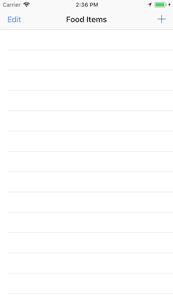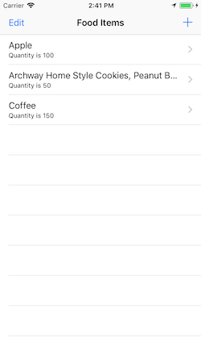

Add item scenes:

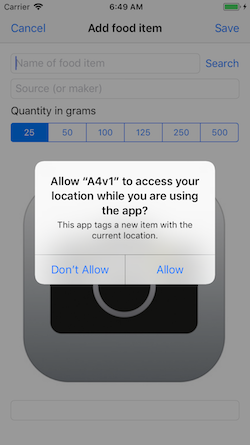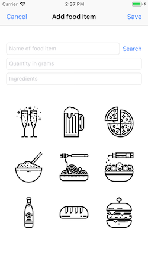

Add a photo scenes:

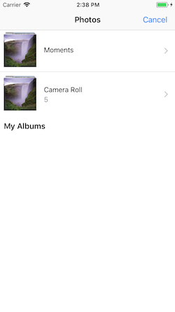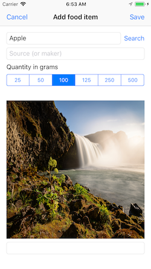

Search for an item, setup, and list of possibles:

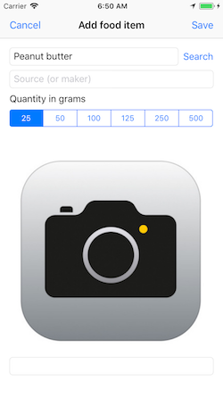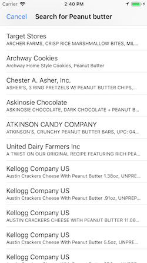

After selecting an item on the list, before saving, and then the result after configuring a photo:

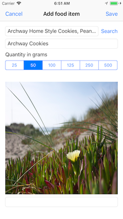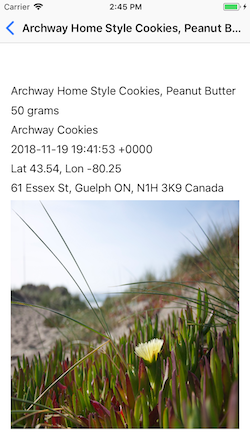

<br>

> DPS923 students will have a few additional specifications. 

<mark>This document is being edited.<br>This notice will be removed when the edits are complete.</mark>

<br>

### Getting started

Use the most recent version of the `TemplateCD...`, and create a project, probably named `FoodDiary`. 

Create a Core Data model. There will be three (3) entities:
* Meal (will have a to-many relationship with FoodConsumed)
* FoodConsumed (to-one with Meal)
* SavedFood

Each entity must have the attributes it needs to implement the specifications. You may have to revise your data model as you work on the assignment. As an example, it could end up looking something like the following:

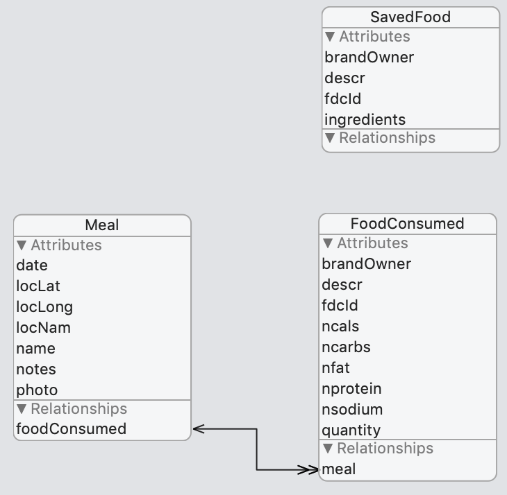

<br>

#### Build the navigation workflow 

The idea here is to build the four-scene *data-viewing workflow*, using statically-generated data, before we get add tasks and the web API involved. It will enable faster progress, easier testing, and improved confidence. 

Edit the project to display Meal objects:
* Change the ExampleList controller name to MealList (Refactor > Rename)
* Edit the code to make it display Meal objects
* Edit the code to enable adds to the list
  * You can continue to use the random string and integer functions in the store initializer 
  * We recommend that the "add" code also adds a few food consumed items to the meal; this will make future work more testable 
* Edit the code to enable deletes from the list

At this point, your meal list may look something like this: 

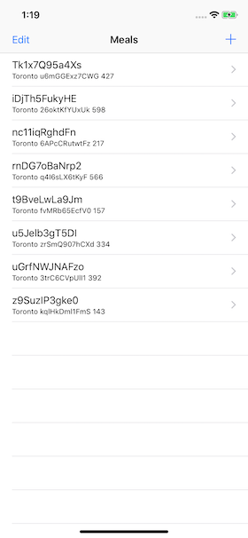

Next, add a meal scene:
* The easiest way is to create a new Swift file
* Then copy from the appropriate file in the Templates folder and then edit the code
* Then do the work to add, configure, and code the scene and segue 

At this point, your meal scene may look something like this: 

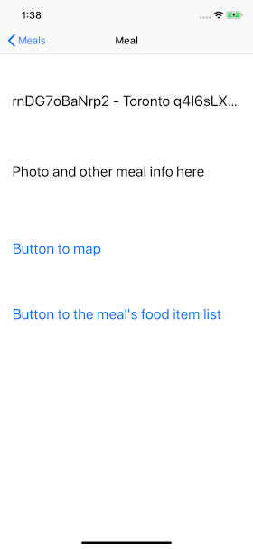

Next, add a food consumed list:
* The easiest way is to create a new Swift file
* Then copy the code from (maybe) MealList and then edit the code (or from the appropriate file in the Templates folder)
* Then do the work to add, configure, and code the scene and segue

> Tip:  
> The data source for this food list must be a fetched results controller (frc).  
> Later, we'll be adding items to the list, and the frc will easily enable the list update task. 

At this point, your food consumed list may look something like this: 

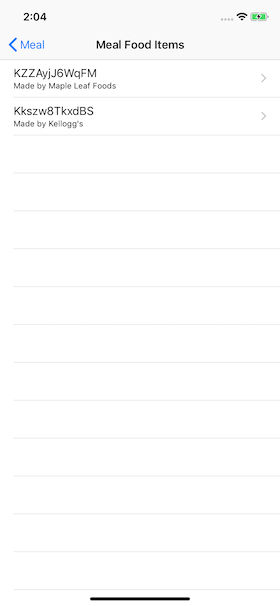

Finally, add a food consumed scene:
* Similar to the other "scene" task above 

At this point, your food consumed scene may look something like this: 

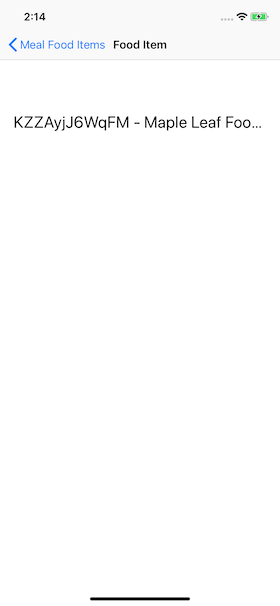

<br>

#### Checkpoint

At this point, you should have the four-scene *data-viewing workflow*, using statically-generated data. 

<br>

### Meal add workflow

Above, you used the built-in template method to add a new meal (and a few food consumed items) programmatically. In this section, we will code the actual "add item" workflows. 

Adding a meal will be done incrementally:
* The "add item" pattern will be implemented 
* The first goal is to add a new meal object 
  * It will enable the storage of a photo
  * And the current location coordinates 
* Then we will add the ability to display the meal's list of food consumed items, which will start off empty 
* The "add item" pattern will enable the addition of a food item to the meal 
* Then we will add the ability to search then select an item from the web API, then save it
* Finally, the ability to segue to the meal scene (that was created above) will be configured 

<br>

#### Add pattern, to add a new meal object

Break the connection between the meal list scene's "add" button and the method that handles the programmatic add task. 

Add a controller for the "add new" meal task. You can create it from scratch, or you can use some code from an appropriate file in the Templates folder. 

In the `save(_:)` method, if you wish, you can add a few food consumed items programmatically. That will enable testing, and you can remove the code later/soon. 

Do the rest of the work to add, configure, and code a scene and segue (from the meal list controller). 

At this point, your food consumed scene may look something like this: 

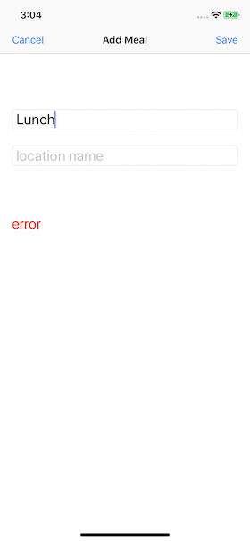

And the result will be added to the list (which you can drill down into and see food consumed items, if you programmatically added them as suggested above). 

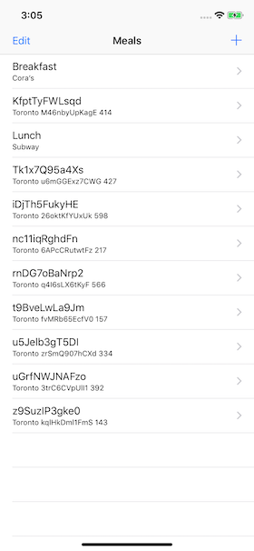

<br>

#### What's next?

What's next? During the "add meal" task, we want the user to interactively add "food consumed" items. We will use a web API to help with this task.

<br>

### Web API introduction

The United States Department of Agriculture has a web API named "FoodData Central". Visit the [web site](https://fdc.nal.usda.gov/index.html), and learn something about the service. 

This is a BIG data source. Thousands of food and nutrient items. 

To use the web API, you must have an "API Key". This is a string. It must be sent with every request to the web API. Follow the "Get an API Key" link in the middle of the page. You can use a College or personal email address. It will display your API key, and also send it to your email address. 

<br>

#### Interact with the web API

Now, interact with the web API. How? Use Postman.

As you will read (follow the "API GUIDE" link), it offers two endpoints:
* Food Search - enter search terms like food name, brand, and so on, and it will return a collection of results 
  * This endpoint must use the POST method
* Food Details - using a unique food identifier (from the food search results above), it will return very detailed ingredient and nutrient information about that food 
  * This endpoint must use the GET method

The following is an example of the "Food Search". In Postman, configure:
* A POST request
* URL is https://api.nal.usda.gov/fdc/v1/search?api_key=YOUR_API_KEY
* Content type header is JSON
* Entity body looks something like the following

```json
{
    "generalSearchInput": "peas fresh",
    "requireAllWords": true,
    "brandOwner": "monte",
    "includeDataTypes": {
        "Branded": true
    }
}
```

On November 17, 2019, at 3:40pm, this request returned two results. Notice a few things:
* `generalSearchInput` is a collection of words that you want to search for. The search is case-insensitive, and word order doesn't matter - it will find results with these words anywhere in the food's description.
* We want to include the `brandOwner` key, with something or nothing in the value. That will help limit the results when appropriate. 
* Also include the `includedDataTypes` key-and-value for this Assignment 4. 

Notice the results include a `fdcId` key, and its value is a six-digit integer. That's the unique food identifier we need for the next query. 

The following is an example of the "Food Details". In Postman, configure:
* A GET request
* URL is https://api.nal.usda.gov/fdc/v1/356446?api_key=YOUR_API_KEY
* Accept header is JSON

Notice the URL - the six-digit integer replaces the static word "search" that you saw before. 

On November 17, 2019, at 3:45pm, this request returned a detailed result. Notice a few things:
* Ingredient and nutrient info is very detailed 
* It essentially has all the data required on a product label (Ingredients and Nutrition Facts). 

Experiment on your own. The documentation is good. 

<br>

#### Design and define structs for the web API interactions

Design and define structs for the web API POST request, and for both kinds of results. 

**Food Search, send (request)**

Use the JSON above to guide your design for the struct used in the Food Search entity body. 

If needed, use the [Web API and data structures](webapi-data-structures) document to help with this task and the ones that follow. 

**Food Search, receive (response)**

For the Food Search result, you are really interested in the `foods` array of items. Each food will definitely have a `fdcId` property. It will likely have a `description` property, but in general, maybe you should define most of the properties (other than `fdcId`) as optional. It is NOT necessary to code them all. 

**Food Details, receive (response)**

For the Food Details result, it has a number of properties that may be useful to us and of interest to you:
* description
* ingredients
* serving size
* fdcId
* brandedFoodCategory

It has two embedded data structures:
* The `foodNutrients` collection is probably too much for our needs in Assignment 4 (so you can ignore it if you wish)
* The `labelNutrients` object is what we want to use - it has the macronutrient (and related) values that will enable us to do some arithmetic

<br>

### Add pattern, food consumed item

Now, we will replace the programmatically-generated food consumed items, for a meal, with the ability for the user to search for a food item. Therefore, we will modify the "add meal" scene. It will navigate to a list of food items (in that meal); that list will enable new items to be added to it, and those new items can be helped by a "select list" of results from a web API call. 

Wait - we already have done a food list. Do we have to make another? Well, we have a choice - we can make another (and it will be almost the same as the other food list), or we can re-use the food list, and modify it to enable the "add" functionality. 

To prepare for either choice, create a new standard view controller for the food item "add new" pattern. Most of its code can be copied from the add meal controller and then edited, or you can write it from scratch. 

It needs a `Meal` property (to hold a passed-in meal object), because we must set the relation between an existing meal and the food items we are adding. 

> We'll do this in two phases.  
> Phase 1, we'll hand-type the food consumed item details.  
> Phase 2, we'll get the data from the web API. 

Placeholder images:

Food item list before searching:

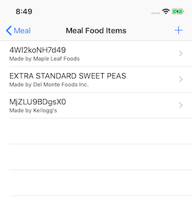

Enter food description and brand owner:

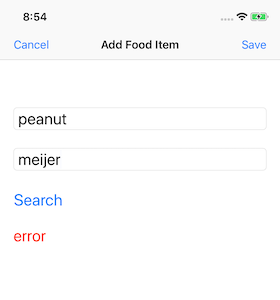

After "Search" button tapped, a list appears:

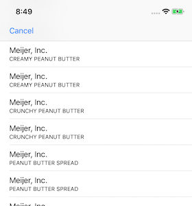

Selecting an item from the list fills in the "Add Food Item" fields:

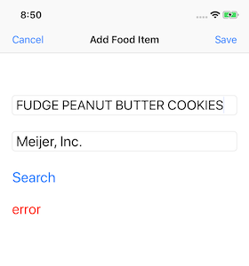

Tapping "Save" adds the item to the list:

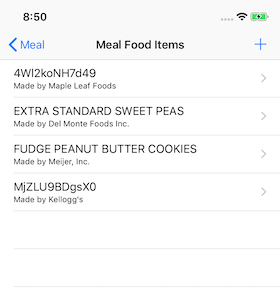

Here's a brief video, for Safari users only:


( more to come )

FoodSearchList  
Table view controller  

Data comes from a web API request  
These techniques will be taught or documented:
* select list 
* segue guard
* header on a table, to provide how-to instructions
* URL tactic (replace) for this app
* map

( more to come )

<br>

### Improvements 

Sections in the meal list (by date)  
Selecting the meal's date in the add scene (picker)  
Map usage  
Appearance  
(more to come)

<br>

### DPS923 additional functionality

DPS923 students must implement the following additional functionality:
* TBA

<br>

### Testing your work

Test your work by running it on the simulator. Do this frequently and incrementally, after making any substantial changes. And, use the Xcode debugger to help. 

When the app is complete, create screen captures. Here's what each scene will show:
1. TBA

<br>

### Reminder about academic honesty

When you are ready to submit your work, you will copy some of the code in your project to plain text files, so that the My.Seneca/Blackboard "SafeAssign" tool can do its job. The next section will tell you which files to copy.

> From the Blackboard web site:  
> SafeAssign compares submitted assignments against a set of academic papers to identify areas of overlap between the submitted assignment and existing works.

<br>

### Submitting your work

Follow these instructions to submit your work, before the due date and time:  

1. Locate your project folder in Finder (and we suggest that you make a copy for yourself).

2. At the same level, create a new folder named "MyCode".

3. From the project folder(s), copy these source code files to the "MyCode" folder:  
**TBA.swift**  
**DataModelClasses.swift**  
**DataModelManager.swift**  
**Main.storyboard**  
For each of these files, change the file name extension to "txt".

4. From wherever, copy the screen captures into the MyCode folder. Rename them to (TBA). 

5. Select the top-level folders:  
(project)  
MyCode  
Right-click, and choose **Compress 2 Items**, which creates a zip file (make sure the zip file is fairly small, around 2MB or less).  

6. Login to Blackboard/My.Seneca, and in this course's Assignments area, look for the upload link, and submit your work there.  

<br>
