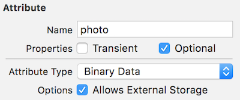
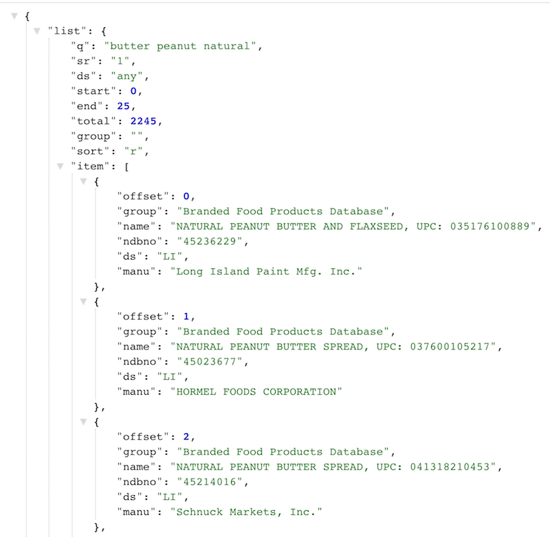

## DPS923 and MAP523 Assignment 4

Assignment 4 gathers a number of topics together in a right-sized piece of work. 

Read/skim all of this document before you begin work.

While you are doing the work, if a *specific task* is not clear, or it seems to require an unreasonable amount of time to complete, contact your professor. 

<p style="color: red;">This document is being edited.<br>This notice will be removed when the edits are complete.</p>

<br>

### Due Date

Wednesday, December 5, 2018, at 11:00pm ET  
Grade value: 20% of your final course grade

*If you wish to submit the assignment before the due date and time, you can do that.*

> It is *VERY IMPORTANT* to submit your work before the due date and time.  
> This assignment *CANNOT* be late.  
> If it is not submitted by the due date and time, your Assignment 4 grade will be zero.  
> Grading will begin the morning after the submission date and time.  

<br>

### Overview and purpose

We need an app that will enable you to capture and store information about the food you eat during the day. 

It is important for everyone to have good nutrition habits. Diet and nutrition issues are too easy for people to ignore and dismiss as unimportant, but good food brings health, both in body and in mind. Modern society and culture have increased interest in food and health, so an app like this could be useful.

In general, the app features include:
* Can capture info about food items consumed
* The food item name or identification can be entered by you, or provided by a public web service 
* Your additional notes/text can be added 
* The new item will have its location info stored (where, when, and so on) 
* Optionally, a photo of the food/meal can be taken 

Here are some sample screen capture images...

> Notice:  
> Some of these images will be refreshed/replaced.  
> They were accumulated during early iterative work on a sample solution by your professor.  
> Some are showing fields or values that have since been changed.  
> Follow the printed instructions below for authoritative info about what your scenes should look like.  

<br>

The "first launch" scene; an empty list, and with some items:


Add item scenes:


Add a photo scenes:


Search for an item, setup, and list of possibles:


After selecting an item on the list, before saving, and then the result after configuring a photo:


<br>

### Getting started

Use the TemplateCDv1 as a base - it's in the [course's code repository](https://github.com/dps923/fall2018), in the templates and solutions folder. Follow it's how-to instructions in the "read me" document. 

At this point, the app will load and run correctly, and enable you to create and delete "example" entity objects. These objects are persisted in a Core Data store. All the base / infrastructure programming bits are provided in the template. 

Reminders:

The template's design and code is explained in this document:

[Info: Project Template for Core Data projects](/topics/info-project-template-core-data)

How-to-use information is in this document:

[How-to: Template for Core Data apps](/topics/how-to-core-data-template)

Build and run (and test) frequently. Do these tasks incrementally, so that you build upon success and do not leave problems behind. 

<br>

#### App building tasks, in sequence

Here's a list of the anticipated tasks to be done to build the app:
1. Design and define the data entity
2. Create and configure a data manager for the entity
3. Create a list controller and scene
4. Create an add-new controller and scene
5. Add location services (including reverse geocoding)
6. Add camera (and photo library) handling
7. Create and test an item-selection controller, protocol, and scene  
  
Then, add the ability to work with a web API:  
<ol start="8">
<li>Get the web API templated code</li>
<li>Study and interact with the web API</li>
<li>Design and define structs that match the shape of the data from the web API</li>
<li>Create, configure, and test a data manager</li>
<li>Edit the item-selection controller to use the data manager</li>
</ol>

Fine-tuning and appearance improvement:
* Photo button
* Photo thumbnail
* Number formatting
* Date formatting

<br>

### Doing the work, data model

Again, as noted above, read/skim the rest of this document before you begin work. That way you know what's coming. 

<br>

#### Design and define an entity

Open the Core Data model editor. (In other words, click on the `AppData.xcdatamodeld` item in the project navigator.) 

Add an entity (probably named FoodItem). Add some attributes. All are strings, unless noted otherwise:
* name - for the food item's name
* source - the source or maker of the food item
* quantity - quantity consumed (in grams) (Integer 32 type)
* notes - this can hold your notes or comments about the food item
* timestamp - this holds the object's creation date-and-time (Date type)
* lat - latitude (Double type)
* lon - longitude (Double type)
* location - holds the address result of the reverse geocode task
* photo - holds the food item's photo (Binary Data type)
* photoThumbnail - holds a smaller lower-resolution version of the photo (Binary Data type)

The `photo` attribute should be configured as shown in the following image. The "allows external storage" feature that enables efficient storage of large binary data objects. For some combination of large-size objects and/or a large number of these objects will cause Core Data to use the file system if it improves performance. Just set it, and the Core Data engine will take care of the rest. 



<br>

After you complete this Core Data model editor work, Xcode will generate, and make available to your code, a class named FoodItem. 

<br>

#### Create and configure a data manager

As you know from the ["how to use" document](https://dps923.ca/topics/how-to-core-data-template), the next task is to create and configure a data manager. Follow the instructions to create a manager extension, probably named: 

`DataModelManager+FoodItem.swift`

<br>

### Add a "list" controller and scene

If you have followed the "how to use" document, then the ExampleList controller and storyboard scenes were deleted. Therefore, we need a controller to show food items. 

If it helps, follow the guidance to [create a controller and scene to view the list of food items](https://dps923.ca/topics/how-to-core-data-template#create-controllers-and-scenes-to-view-the-apps-data). 

<br>

### Add an "info/view" controller and scene

This scene and controller enables the user to view the info about an existing food item. It is a "next" scene in a drill-down navigation flow from the list scene. On the list scene, the user taps one of the rows, and this info/view controller slides in from the right, to show the item's details in some combination of labels, images, or whatever's appropriate for the item's data. 

In the template, the `ExampleSceneBaseCD.swift` source code file can be duplicated and edited to fulfill this task. On the storyboard, the segue will be a standard "show" segue, and in the controller, it will use the "workflow" segue code block. 

The app does not yet have data, so it won't be possible to view this controller's scene until you complete the work in the next section. 

<br>

### Add a controller and scene to "add a food item"

This scene and controller enables the user to add a new food item to the list. As you have done before, this feature is presented by the list controller, via an "Add" `+` button in the right-side area of the top-of-list nav item. 

Do the work in three parts: 
1. Basic functionality to handle text field etc. input 
2. Add on the location services 
3. Add on the camera and photo library handling

If it helps, follow the guidance to [create a controller and scene to add data about a food item](https://dps923.ca/topics/how-to-core-data-template#create-controllers-and-scenes-to-modify-the-apps-data).

<br>

#### Basic functionality 

Let's start with the basic functionality. Some data will be provided (entered) by the user: 
* name
* source
* notes
* quantity
* photo 

Add user interface controls for all except photo. The first three controls should be standard text fields. At your option, you can use a larger text view for the "notes" data.

The "quantity" UI should be a segmented control, with button segments for these values:  
25, 50, 100, 125, 250, 500


> Tips about the segmented control:  
> The `selectedSegmentIndex` property has the tapped/touched segment.  
> The `titleForSegment(at:)` method has the text title for a segment index.  
> You can convert that text to the number that you need.  

Do the work that enables the app's user to create food items by providing input for name, source, notes, and quantity. Don't worry about storing unwanted data - you can delete it later - the goal at this point is to save something.  

For the timestamp, get the current date-and-time before saving the new item. 

> Again, don't worry about storing data that you will want to delete eventually.  
> Remember, when you delete an app, all of its data is deleted too, so an easy way to clear all data is to delete the app from the simulator or your device.  
> Alternatively, if you did the "add list controller" task successfully (above), the table view "delete" task should work correctly, and enable you to delete items one at a time.  

<br>

#### Add location services

As you recently learned, *location services* is a device feature that needs the user's permission. It is also a feature that works in an asynchronous manner, so we must be prepared for that. The controller must conform to a protocol, and implement the delegate methods that handle the location update events sent by the iOS runtime. 

The "add new" controller is an ideal place for the location services code. The scene's text fields will gather input from the app user, and it will take a small amount of time to do that. If we activate location services when the controller and scene becomes active, the location update events will be complete when the app user is ready to save the new item. 

The `egLocation` code example in the [course's code repository](https://github.com/dps923/fall2018/tree/master/Week11) has the essential info needed to understand and use location services. 

Add and/or write the code needed in the FoodItemAdd controller class. Make sure that the location data (latitude, longitude, and address) are saved with the new food item. 

Remember to go back to the food item info/view controller and scene, and add in the location-related code. 

<br>

#### Add camera and photo handling

As you recently learned, using the *camera* and/or the *photo library* is a device feature that needs the user's permission. It is also a feature that uses a *built in* "picker" controller, that works the same as our "add new" and "show details" controllers. In other words, the presenting controller must conform to a protocol, implement some delegate methods, and the camera/photo picker scene slides up from the bottom. 

As mentioned above, the *picker controller* is built in, so we do not have to write code for it, but we must write code for the picker's delegate methods. These methods are called by the iOS runtime when the user interacts with the picker (e.g. take photo with the camera, select photo from the library, or cancel). 

Our initial goal is to get and display a photo. The user interface will include a button that presents the picker, and an image view that shows the photo. 

Edit the scene. Add a button that will begin the photo take/pick action. 

> If you wish to use an image for the button, then do this:  
> Locate and import suitable icon/image to the asset catalog; maybe a web search can help with this task.  
> On the button's attributes inspector, change the "Type" to "Custom".  
> Then, in the "Image" dropdown list, select the icon/image that you imported.  
> Size to fit.  

From the button, create an action connection to the controller code. Add an image view that can display a photo. Create an outlet connection to the controller code. 

The `egCamera` code example in the [course's code repository](https://github.com/dps923/fall2018/tree/master/Week11) has the essential info needed to understand and use the camera and photo library. 

Add and/or write the code needed in the FoodItemAdd controller class. Make sure that the photo data is saved with the new food item. How? 

First, it is important to understand the following: 
* A photo, from the camera or photo library, is an in-memory format of type `UIImage` 
* The storage format of a photo, in Core Data, is "Binary Data", which is of type `Data` 
* As a result, they're different types, in different formats
* We must convert, back-and-forth

Next, we must learn how to convert *FROM* a UIImage *TO* a Data:

```swift
// From UIImage to Data
// Assume "photo" is a UIImage
// Assume "item.photo" is the Data property of a Core Data item

// Attempt to create a Data representation of the photo
guard let imageData  = UIImageJPEGRepresentation(photo!, 1.0) else {
    errorMessage.text = "Cannot save photo"
    return
}
newItem.photo = imageData
```

Finally, we must learn how to convert *FROM* a Data *TO* a UIImage:

```swift
// From Data to UIImage
// Assume "item.photo" is the Data property of a Core Data item
// Assume "item.imageView" is an outlet to a UIImageView on a scene

// Attempt to create a UIImage representation of the photo
let photo = UIImage(data: item.photo!)
foodItemPhoto.image = photo 
```

Remember to go back to the food item info/view controller and scene, and add in the photo-related code. 

<br>

### Progress checkpoint

At this point in time, your app should be able to show a list of food items, enable the viewing of any one of them, and enable the creation of new fully-configured food items. 

Here's the list of remaining tasks, from the original list above:
<ol start="7">
<li>Create and test an item-selection controller, protocol, and scene</li>
<li>Get the web API templated code</li>
<li>Study and interact with the web API</li>
<li>Design and define structs that match the shape of the data from the web API</li>
<li>Create, configure, and test a data manager</li>
<li>Edit the item-selection controller to use the data manager</li>
</ol>

Fine-tuning and appearance improvement:
* Photo button 
* Photo thumbnail
* Number formatting
* Date formatting

The suggested plan or strategy is to 1) create an item-selection controller and use in-memory data items to select among, and then 2) adapt it to use data items fetched from a web API. 

<br>

### Item-selection controller idea and creation

In our app, we need a way to *select an item*. What item? Something *from a list* of search results. 

This is a common task in apps. All students will be familar with the use of `select` and `option` elements in HTML, and how they are used to make a list of items. On a web page, we typically see this kind of feature as a "list box" or a "dropdown list", as shown in the web page example, below left. 

A similar example has been prepared for a list (table view controller) scene in an iOS app, as shown below right.


<br>

How can we do this for our app? There are several ideas involved. 
1. First, we need a list (table view) controller and scene
2. It will be a "task" scene, so it will slide up from the bottom (as other task scenes do), as a result of an action segue in the presenting controller 
3. As a result, it will define a protocol, with a "cancel" method 
4. It will need data, from somewhere (memory, data store, the network; typically by calling a manager method), and data items will render in table view rows
5. When a row is tapped/selected, a handler will call a delegate method, and pass back the data represented by the selected row to the presenting controller
6. The presenting controller can do whatever it needs to with the passed-back data 

<br>

The `egSelect` code example in the [course's code repository](https://github.com/dps923/fall2018/tree/master/Week11) has the essential info needed to understand and use an item-selection list. 

As noted above, we suggest that you first implement the item-selection controller with in-memory data items. (For example, create an array of strings in the controller's `viewDidLoad()` method.) 

Earlier, on the "add new" scene, you probably configured your food item name text field to span the full width of the scene. We suggest that you reduce its size so that you can fit a "search" button to its right. The button will cause an action segue to show the item-selection controller. 


At this point, your app should be able to enable the user to add a new food item by entering its name in the text field, or by using the item-selection controller. 

<br>

### Get the network involved

This will be a lengthy task, partly because you will be learning a number of techniques. We suggest that you read/skim the content below before doing the work, so that you will know what's coming. 

The `egWebApiGet` code example in the [course's code repository](https://github.com/dps923/fall2018/tree/master/Week11) has the essential info needed to understand and use the network.

<br>

#### Get the web API templated code

Your professor has created a class - `WebApiRequest` - that improves the process of working with a web API. One of the problems in this topic area is the wide and variable number of so-called "best practice" approaches. The problem is that many of them are NOT scalable, and/or repeatable, and/or adaptable. 

The [course's code repository's Week 11 folder](https://github.com/dps923/fall2018/tree/master/Week11) has the code needed. (It's also in the templates and solutions folder.)

Add the `WebApiRequest.swift` source code file to your project. 

The other files can be used as guidance only, and/or copy-code sources. Do NOT replace your existing manager and data model classes source code files. 

<br>

#### Study and interact with the web API

For this project, we will work with the United States Department of Agriculture Food Composition Databases web API. Yes, there are many other data sources, but this will meet the needs of this project very nicely. 

Visit this page to learn about its features:  
[https://ndb.nal.usda.gov/ndb/api/doc](https://ndb.nal.usda.gov/ndb/api/doc)  

To use the web API, you have an "API key". This is a string. It must be sent with every request to the web API. Visit this page to request an "API key":  
[https://ndb.nal.usda.gov/ndb/api/doc](https://ndb.nal.usda.gov/ndb/api/doc)  
Near the middle of the page, there is a "Gaining Access" section. Follow its instructions. You can use a College or personal email address. It will send the "API key" to your email address. 

Now, interact with the web API. You can use a browser to compose requests, or you can use a tool like Postman. (The browser is enough for our needs.)

Notice that the "base" or first part of the URL for all searches looks like the following:  

https://api.nal.usda.gov/ndb/search/?

Then, we append at least two more key-value pairs:
1. Your "API key" 
2. The desired search terms

Other key-value pairs can be added, and they are documented on the page linked above. A commonly-used pair - `max=25` - will limit the number of returned results to the value provided (i.e. 25 items). 

Here are some example queries (which can be sent in a browser; replace "YOUR_API_KEY" with your "API key"). Notice that multi-word search terms are encoded (in other words, the space has been encoded as `%20`) Multi-word search terms are treated as "and" situations, and will return results that include all words (or synonyms/equivalents).

Search for "butter":  
[https://api.nal.usda.gov/ndb/search/?max=25&api_key=YOUR_API_KEY&q=butter](https://api.nal.usda.gov/ndb/search/?max=25&api_key=YOUR_API_KEY&q=butter)

Search for "butter peanut":  
[https://api.nal.usda.gov/ndb/search/?max=25&api_key=YOUR_API_KEY&q=butter%20peanut](https://api.nal.usda.gov/ndb/search/?max=25&api_key=YOUR_API_KEY&q=butter%20peanut)

Search for "butter peanut natural":  
[https://api.nal.usda.gov/ndb/search/?max=25&api_key=YOUR_API_KEY&q=butter%20peanut%20natural](https://api.nal.usda.gov/ndb/search/?max=25&api_key=YOUR_API_KEY&q=butter%20peanut%20natural)

Make sure that you are comfortable with the interaction pattern. It is essential that you have some experience doing this BEFORE you begin coding it into an iOS app. 

<br>

#### Design and define structs that match the shape of the data from the web API

Carefully study the responses to your queries. Your task in this section is to design and define structs that match the shape of the response data. 

> There's no magic shortcut that makes this process easier.  
> Take your time, be careful, and when you are able to test the request in your app, pay attention to any error messages that appear in the debug console area.  

The image below shows the response from the last query above (butter peanut natural). Notice its structure or packaging scheme: 
* The outer package is an object, and has ONE key-value pair, "list". 
* The value of "list" is an object. 
* Some of the values are strings, and others are numbers. 
* The "list" object has a key named "item", and its value is an array (collection). 
* The contents of the array is a collection of objects. 
* Each object has the data we need for our app, specifically the values of "name" and "manu". 



<br>

As suggested above, three structs will be needed - an outer package, another for the "list" value, and another for an "item" value. If you are looking for suggested struct names, you can use these:
* NdbSearchPackage - for the outer container package 
* NdbSearchList - for the "list" value 
* NdbSearchListItem - for an "item" value 

<br>

<mark>( more to come )</mark>

<p style="color: red;">The following is a preview of what we'll do. Updates are coming soon.</p>

#### Create, configure, and test a data manager

Create a new Swift file.  
It will be an extension to DataModelManager.  
It will have one (1) method, `foodItem_Search(searchTerms:)`  
It will update an instance variable to hold a collection of items.  
This collection can be used by an item-selection controller.  

#### Edit the item-selection controller to use the data manager

Adapt the previously-created item-selection controller to use the search results collection that's stored in the manager.  

Notification.  

<br>

### Fine-tuning and appearance improvement:
* Photo button 
* Photo thumbnail
* Number formatting
* Date formatting

~ ~ ~ 

<br>

### Testing your work

Test your work by running it on the simulator. Do this frequently and incrementally, after making any substantial changes. Use the debug tool when it's useful to do so.

<br>

### Reminder about academic honesty

When you are ready to submit your work, you will copy some of the code in your project to plain text files, so that the My.Seneca/Blackboard “SafeAssign” tool can do its job. The next section will tell you which files to copy.

> From the Blackboard web site:  
> SafeAssign compares submitted assignments against a set of academic papers to identify areas of overlap between the submitted assignment and existing works.

<br>

### Submitting your work

Follow these instructions to submit your work, before the due date and time:  

1. Locate your project folder in Finder (and we suggest that you make a copy of it for yourself).

2. In that folder, add a new folder named "MyCode".

3. Copy these source code files to the "MyCode" folder:  
**Main.storyboard**  
**DataModelClasses.swift**  
**DataModelManager.swift**  
<mark>( more to come )</mark>  
For each of these files, change the file name extension to "txt".

4. Right-click the folder, and choose **Compress “xxxxxxxx”**, which creates a zip file.  

5. Login to Blackboard/My.Seneca, and in this course's Assignments area, look for the upload link, and submit your work there.  

<br>
