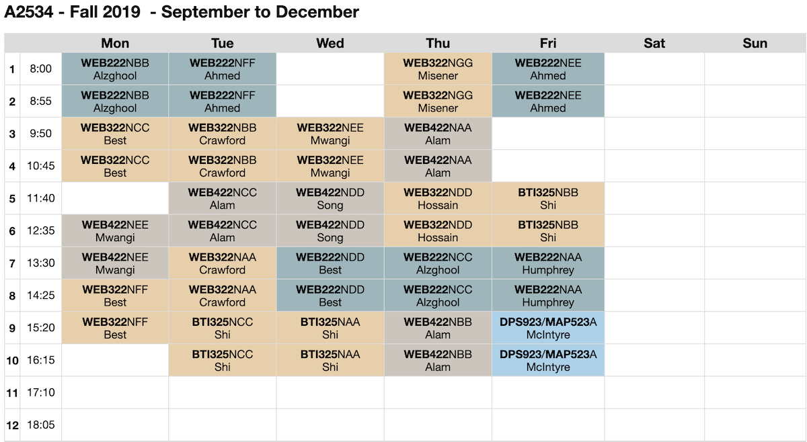

## Learning resources

This page has information about and links to learning resources that you will use in this course.

 

### Developer tools

You *must* use a Mac that runs a recent version of macOS. Any kind, laptop, iMac, or Mac mini. The College has lots of Macs, and the School of ICT has a dedicated Mac lab, room A2534. 

* [Xcode](https://developer.apple.com/xcode/) (we will probably use version 9) 

You will need one or more devices. A College or personal desktop or laptop that runs macOS, and (likely) a personal mobile device (e.g. a smartphone). 

 

#### Use macOS

As noted in the [welcome note](welcome), course work is done on a Mac.

If you are not prepared to use a Mac, then *drop the course*.

 

#### Our Mac mini lab, room A2534

The image below shows the room timetable. As you can see, the room has classes most of the week. However, it appears to be consistently available from 5:10pm onwards, and on the weekend. 

 

### Course textbook

For the Fall 2019 version of the course, no textbook is required. We will use online resources from Apple and elsewhere. Some of these resources may be fee-based, but the fee is typically low. 

 

### Required online resources

[Apple Developer community](https://developer.apple.com/develop/)  
The web site is vast, with thousands of documents. It is a trusted and authoritative source for web developer information. 

[Apple Human Interface Guidelines](https://developer.apple.com/design/human-interface-guidelines/ios/overview/themes/)  
The official source for designing iOS apps. Also includes excellent content to help you learn iOS user interface elements and usage. 

Apple Developer Documentation  
[Landing page](https://developer.apple.com/documentation) - links to all kits and frameworks for all platforms.  
Your professor will demonstrate effective web search techniques.  

 

### Swift language resources

[Documentation](https://swift.org/documentation/)
* A Swift Tour
* Language Guide
* Language Reference

 

### Xcode tips and info

Xcode Application Help (from Apple, in [HTML](https://help.apple.com/xcode/mac/9.0/) format)  
(also available on the Xcode ‘Help’ menu)

Simulator Application Help (Apple, [HTML](https://help.apple.com/simulator/mac/9.0/))

 

#### Keyboard shortcuts quick reference sheet

Learning some keyboard shortcuts will improve your productivity and your enjoyment of Xcode. Learn some - a dozen or so will make a big difference. 

[Click this link](media/xcode-kb-shortcuts2018v1.pdf) to download a quick reference sheet of Xcode keyboard shortcuts. 

Xcode Gestures and Keyboard Shortcuts (Apple, [HTML](https://developer.apple.com/library/archive/documentation/IDEs/Conceptual/xcode_help-command_shortcuts/Introduction/Introduction.html))

 
