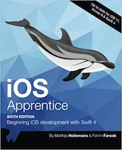

## Learning resources

This page has information about and links to learning resources that you will use in this course.

 

### Developer tools

You *must* use a Mac that runs a recent version of macOS. Any kind, laptop, iMac, or Mac mini. The College has lots of Macs, and the School of ICT has a dedicated Mac lab. 

* [Xcode](https://developer.apple.com/xcode/) (we will use version 9) 

You will need one or more devices. A College or personal desktop or laptop (Mac), and (likely) a personal mobile device (e.g. a smartphone). 

 

#### Use macOS

As noted in the [welcome note](welcome), course work is done on a Mac.

If you are not prepared to use a Mac, then drop the course.

 

#### Other Macs on campus

The library (learning commons) has Macs. There are also three Mac labs, S2112, S2113, and S2046. 

The versions of macOS, Xcode, and Swift are a bit newer in our School of ICT Mac lab in DB3078. Therefore, we *strongly recommend* that you configure your iOS projects to target iOS version 11.0 or 10.x. That way, you can work on your project on any of the campus Macs. 

> Your professor will show you how to target an iOS version.

 

### Required textbook

[iOS Apprentice, Sixth Edition](https://store.raywenderlich.com/products/ios-apprentice) 

Available as an ebook and a physical book. Direct from the publisher, or via Amazon.ca if you want a physical book. 

The publisher has provided our students with a *substantial* discount. Contact your professor for details. 

 

#### A few thoughts about the required textbook

This course has a required textbook. Our pathway through the course will closely track the textbook chapter sequence. Your professor will contribute little or no original conetnt. Don't want to buy the book? You probably won't pass the course. Want to steal the book (i.e. not pay the publisher)? Well, it's your life, morals, and ethics, but keep in mind that the authors are simply asking to be paid for their efforts. Will you ever want to get paid when you graduate and get into the workforce? Yup, you will, so think of this before you steal. Also, think about how often you must buy a textbook for a course - not too often, so this is not a hardship. 

 

### Required online resources

[Apple Developer community](https://developer.apple.com/develop/)  
The web site is vast, with thousands of documents. It is a trusted and authoritative source for web developer information. 

[Apple Human Interface Guidelines](https://developer.apple.com/design/human-interface-guidelines/ios/overview/themes/)  
The official source for designing iOS apps. Also includes excellent content to help you learn iOS user interface elements and usage. 

Apple Developer Documentation  
[Landing page](https://developer.apple.com/documentation) - links to all kits and frameworks for all platforms.  
Your professor will demonstrate effective web search techniques.  

 

### Swift language resources

[Documentation](https://swift.org/documentation/)
* A Swift Tour
* Language Guide
* Language Reference

 

### Xcode tips and info

Xcode Application Help (from Apple, in [HTML](https://help.apple.com/xcode/mac/9.0/) format)  
(also available on the Xcode ‘Help’ menu)

Simulator Application Help (Apple, [HTML](https://help.apple.com/simulator/mac/9.0/))

 

#### Keyboard shortcuts quick reference sheet

Learning some keyboard shortcuts will improve your productivity and your enjoyment of Xcode. Learn some - a dozen or so will make a big difference. 

[Click this link](media/xcode-kb-shortcuts2018v1.pdf) to download a quick reference sheet of Xcode keyboard shortcuts. 

Xcode Gestures and Keyboard Shortcuts (Apple, [HTML](https://developer.apple.com/library/archive/documentation/IDEs/Conceptual/xcode_help-command_shortcuts/Introduction/Introduction.html))

 
