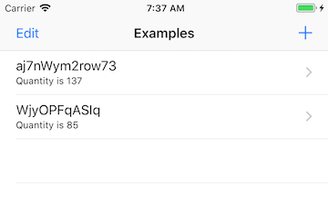
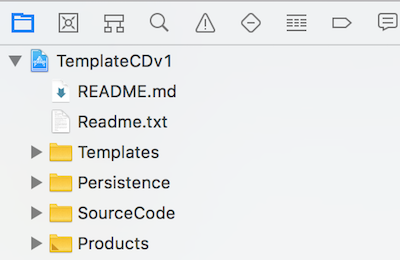
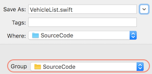

## How-to: Template for Core Data apps

This document describes how to use the template to build an app that uses Core Data for persistence. 

 

### Reminder - get the template

In the course's GitHub repository, in the [Templates_and_solutions](https://github.com/dps923/fall2018/tree/master/Templates_and_solutions) folder, 
you will see a project named **TemplateCDv1**.

Make a copy of that, and you will have all you need to start working on a new project.

> How do I make a copy?  
> The Readme.txt file in the project helps you do this.

 

### Run the app

As delivered, the app will build/compile and run successfully. 

The app has one defined entity, "Example". On first launch, the app creates two Example objects. The first controller to load is a table view controller, "ExampleList". The controller enables the app user to add new objects to the list (by using the `+` control), and also to remove objects from the list (using the `Edit` control, or by using swipe-left-to-delete). There are no other controllers. 

 

### Files in the app

As delivered, there are three "groups" of files:

**SourceCode** has the app's active working controller code, and the app delegate. 

**Persistence** has the app's persistence-related modules, including the data model manager, data model classes, and the Core Data stack of objects. 

**Templates** has controllers that you can copy ("duplicate"), and storyboards (with copy-ready scenes) for each controller. This folder is an important part of the template, because it will help you build apps faster and with higher quality. Although the names should suggest their purpose, here's a brief explanation of each:

* ExampleListBaseCD controller and storyboard  
Can be used as a standard "list"  
Storyboard includes a nav controller and a table view controller

* ExampleSceneBaseCD controller and storyboard  
Can be used as a standard "scene"  
For drill-down and/or object show/view scenarios  
Storyboard includes a standard view controller and a label  

* ExampleAddCD controller and storyboard  
Can be used to add a new entity object  
Intended to be presented modally  
Includes a protocol, requires a delegate (the presenting controller)  
Storyboard includes a nav controller and a standard view controller, cancel and save buttons, and input fields/controls to gather input from the app user  

* ExampleEditCD, and ExampleAddEditCD controllers and storyboards  
Similar in theme and meaning to the "add" assets  

* ExampleDetailCD controller and storyboard  
Can be used to show/view an existing entity object  
Intended to be presented modally  
Includes a protocol, requires a delegate (the presenting controller)  
Storyboard includes a standard view controller and a label

 

### Parts of the app that you can change

As noted above, the app template (as delivered) works correctly. However, your app will not use the "Example" entity, and will not use the "ExampleList.swift" controller and its scenes (nav controller and table view controller) on the "Main.storyboard". 

Therefore, before you begin adding your own code assets, you can remove (delete) these items:
* The "ExampleList.swift" controller 
* The starter scenes on the "Main.storyboard" 

 

### Parts of the app that you should not change

As shipped, the app has an "Example" entity defined in the Core Data model. Leave it there, or the code in the templated controllers will not compile, and your app will not run. 

Also, leave the templated controllers and storyboards as-is. While they can probably tolerate some changes, leave them as-is until you gain more experience with the template, and are more confident about making changes. 

 

### General app-building tasks

Before starting the app-building task, it should be obvious that the programmer must have an overall plan or vision for the app. What will it do? What data does it need?

Then, in general, there are a few typical tasks done when building or assembling an app:
1. Design and define the data entities 
2. Create and configure a data manager 
3. Create controllers and scenes to view the app's data
4. Create controllers and scenes to modify the app's data

The remainder of the document enables the programmer to learn how to use the template to build or assemble the app. 

For best results, do these tasks on a per-entity basis, in sequence. Yes, per-entity, designing the entity and configuring its manager is typically done once, at the beginning, but creating controllers for that entity will probably be done repeatedly (i.e. list, scene, add, edit, etc.) until the app's specifications are complete. 

 

### Design and define the data entities 

Using the Core Data model editor, create an entity, and configure it with all the necessary attributes. For purposes of this document, let's assume that we are creating an entity that describes a car/truck/etc., named "Vehicle". 

> Soon, you will learn how to create a more complex data model, with entities that can be related to one another. 

 

### Create and configure a data manager 

As you have learned, each entity will have its own data model manager class. 

As delivered, the app has a "DataModelManager+Example.swift" source code file with methods for the "Example" entity. It is ideal as a manager for your new entity. 

In the project navigator, select the file. On the Xcode File menu, choose Duplicate. The new file name will use the same format as the original, and will probably be (assuming that we are creating the manager for the Vehicle entity):

`DataModelManager+Vehicle.swift`

Open the file for editing. Do a Find-Replace in the file (Option+Command+F). Look for *case sensitive* replacements, and replace "Example" with "Vehicle", and "example" with "vehicle". Then, fix up any other logic that causes build/ compile errors (e.g. attribute names and so on). The final result should be that the app builds/compiles cleanly, which means that your new entity and manager are ready for use by your new controllers.

 

### Create controllers and scenes to view the app's data

If you are configuring the app's *first* controller (because you just removed the as-delivered "ExampleList" controller and storyboard scenes), then you will probably want to create a list controller (for a list of Vehicle objects). That being the assumption...

In the project navigator, select the "ExampleListBaseCD.swift" file. On the Xcode File menu, choose Duplicate. The new file name will be simple, something like "VehicleList.swift". 

Change the "Group" to SourceCode - that's where we want the duplicated controller to end up. 

Then, similar to what you did above, open the file for editing. 

Do a Find-Replace in the file (Option+Command+F). Look for *case sensitive* replacements, and replace "Example" with "Vehicle", and "example" with "vehicle". 

Then, fix up any other logic that causes build/compile errors (e.g. attribute names in the `frc` statement and in the `tableview(_:cellForRowAt:)` method, the controller title, and so on). 

Ensure that the class name is "VehicleList". Finally, edit the app delegate so that it references this new controller. 

#### Storyboard

Assuming that Main.storyboard is now empty... Open the ExampleListBaseCD.storyboard. Lasso the existing two rectangles (the nav and table view scenes). Copy. In Main.storyboard, click in the empty scene area, and Paste.  

On Main.storyboard, set the nav controller as the initial view controller (the entry point). Set its Storyboard ID too (to "VehicleList").  Select the table view controller. Set the class name to "VehicleList". 

 

### Create controllers and scenes to modify the app's data

After creating the VehicleList assets, you should have a good idea about the process. Yes, it's copy, paste, edit, and test. 

The next feature could be a way to add a new Vehicle object. 

In the project navigator, select the "ExampleAddCD.swift" file. On the Xcode File menu, choose Duplicate. The new file name will be simple, something like "VehicleAdd.swift". Change the "Group" to SourceCode - that's where we want the duplicated controller to end up. 

Then, similar to what you did above, open the file for editing. 

Do a Find-Replace in the file (Option+Command+F). Look for *case sensitive* replacements, and replace "Example" with "Vehicle", and "example" with "vehicle". 

Then, fix up any other code that causes build / compile or logic errors. 

#### Storyboard

Open the ExampleAddCD.storyboard. Lasso the existing two rectangles (the nav and standard view scenes). Copy. In Main.storyboard, click in the empty scene area, and Paste.  

On Main.storyboard, set the nav controller's Storyboard ID (to "VehicleAdd"). From the presenting controller, make a segue (Action Segue > Present Modally) to the nav controller, and set its identifier.

Select the standard view controller. Set the class name to "VehicleAdd". Edit the user interaction controls to match your needs, and make the outlet connections to the VehicleAdd.swift source code. 

#### Presenting controller

In the presenting controller source code file, adopt the "add" protocol, copy in the stub methods (from the bottom of the VehicleAdd.swift source code file), code the segue (use the "task" segue code), by passing the manager, and set the delegate.

#### Other app building/assembling tasks 

It should now be apparent that it is possible to use the template to help build an app with an appropriate amount of effort. In comparison, starting an app from scratch will take many more hours of effort. 

Study the source code in the template, and practice the techniques in this document a few times, and you will be much better prepared to build iOS apps. 

 
