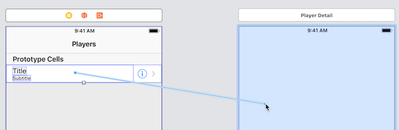
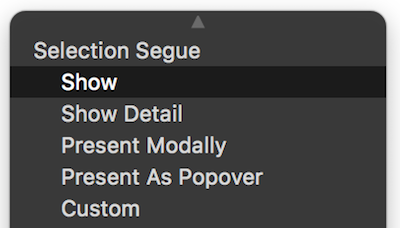

## How-to: Navigation from table view, disclosure &nbsp;&gt;

Assumption(s):
* Table view scene and controller already exist

We will add a new controller and scene, and a "disclosure" hierarchical segue navigation.

In the project navigator, focus on the yellow project folder icon, and create a new file (&#8984;N). It will be a Cocoa Touch Class. Next, make it a subclass of UIViewController. 

> Tip - Use the name "SomethingInfo" or "SomethingScene" for the class name.  
> Avoid using the words "view" and "controller" in the name.

Show the main storyboard in the editor. 

From the library, add a new view controller. On its identity inspector, set its class to the just-created class from above. 

Select the table view scene that will be the navigation source. Select its table view cell object (the white area just below the "Prototype Cells" label). 

On its attributes inspector, the accessory offers settings for: 
* Disclosure Indicator&nbsp;&gt;, if we are supporting ONLY hierarchical navigation  
* Detail Disclosure&nbsp;&#9432;&nbsp;&gt;, if we are supporting BOTH detail navigation, and (drill-down) disclosure navigation
* Detail&nbsp;&#9432;, if we are supporting ONLY detail navigation 

Choose *Disclosure Indicator*. 

Next, create a segue. (Make sure that the table view scene, and its table view cell object is still selected.) Control+click+drag from the table view cell object to the new destination scene. 



<br>

On the pop-up, choose Selection Segue > Show. 



> **Disclosure** navigation is matched to the **Show** segue.

<br>

Select the segue object. On its attributes inspector, enter an appropriate value for the Identifier property. We suggest that it begin with the word "to" (because we are navigating "to" this scene) and an appropriate name for the scene. For example, "toSomethingInfo". 

<br>

### Test your progress

First, make sure that your table view shows one or more items. If it does not do that yet, then [complete this task](how-to-new-app-tvc#test-your-progress) before continuing.

Then, build-and-run. Tapping (clicking) anywhere on the row (except on the detail accessory &#9432;) should navigate to your new disclosure view.

<br>

### Pass data to the disclosure view

Almost always, when a specific row is tapped, you will want to pass its data to the disclosure view. 

First, make sure that the disclosure view controller has a property (instance variable) to hold the data. You can choose its data type to fulfill your use case. (Sometimes the data will be a simple value like a string. In other scenarios, an object or collection will be passed on.) For example:

```swift
// Simple string
var nameThing: String!
```

...or...

```swift
// Product object
var selectedProduct: Product!
```

> This technique is described in the document  
> [How to: Configure data for a controller]()

<br>

Next, in the table view controller, uncomment the [`prepare(for:sender:)`](https://developer.apple.com/documentation/uikit/uiviewcontroller/1621490-prepare) method. 

Write an ```if``` statement to match the segue identifier. 

```swift
if segue.identifier == "toSomethingInfo" {
  // your code goes here
}
```

Inside the `if` statement, initialize the NEXT controller, and set its value to the segue destination. Remember to [cast it to the appropriate controller type](https://docs.swift.org/swift-book/LanguageGuide/TypeCasting.html#ID342).

```swift
let vc = segue.destination as! SomethingInfo
```

Now, we need to discover which row was tapped, so that we can go back to the data model (source) and fetch the data to be passed on. 

> Remember, the table view itself is NOT the data source - it is simply displaying some content from the data source. 

<br>

Add astatement that gets the tapped row's index path. (Read [the documentation](https://developer.apple.com/documentation/uikit/uitableview/1614881-indexpath) for the `indexPath(for:)` method.)

```swift
let indexPath = tableView.indexPath(for: sender as! UITableViewCell)
```

> Tip:  
> Some online help documents state that this property...  
> `tableView.indexPathForSelectedRow`  
> ...should be used, instead of the recommended method:  
> `tableView.indexPath(for:)`  
> Sorry, no. That property works ONLY for row selections (taps).   
> This `indexPath(for:)` method works for BOTH disclosure and detail accessories.  
> Much better. 

<br>

Next, get the data, pass it on, and set/configure the next scene's title property: 

```swift
// use the index path to fetch what you want from the data model
// assume that "arrayDataSource" is an array, and the data source
let selectedData = arrayDataSource[indexPath!.row]

// pass it on (set the destination controller's data property)
// assume that the destination controller has a "dataObject" property
vc.dataObject = selectedData

// if necessary, pass on a reference to the app's data model manager
// assume that "model" is the name of the data model manager variable
vc.model = model

// set the destination controller's title property
// assume that selectedData has an "appropriateTitleText" property
vc.title = selectedData.appropriateTitleText
```

<br>

At this point in time, the navigation should work correctly.

<br>

### Refinement... guard against runtime errors

The code is above is good enough for beginners. However, it does NOT handle a scenario where the segue action will fail because of a bad index path or the absence of valid data. 

In a production app, especially one that works with data from different kinds of persistent stores (Core Data, web service), it is a good idea to check and ensure that the segue will succeed, before the `prepare(for:sender:)` segue method is called. 

Here's how to improve the code: Add a new `shouldPerformSegue(withIdentifier:sender:)` method. The iOS runtime will call this method first. If it returns `true`, then it will call the `prepare(for:sender:)` method. Nice. 

<br>

#### Add a `shouldPerformSegue()` method 

Add the following code just before `prepare(for:sender:)`:

```swift
override func shouldPerformSegue(withIdentifier identifier: String, sender: Any?) -> Bool {
    
    // Verify that we can get the selected row's index path
    // and that it is associated with data in the app's data model
    
    // If it's a row selection/tap, then deselect the row
    if let ipSelected = tableView.indexPathForSelectedRow {
        tableView.deselectRow(at: ipSelected, animated: true)
    }
    
    // Perform two checks...
    // 1. Ensure that we can get an index path, and
    // 2. Ensure that it associated with valid data
    if let ip = tableView.indexPath(for: sender as! UITableViewCell) {
        if arrayDataSource.indices.contains(ip.row) {
            return true
        } else {
            // Before the return, we can optionally
            // notify or alert the user about the problem
            return false
        }
    } else {
        // Before the return, we can optionally
        // notify or alert the user about the problem
        return false
    }
}
```

<br>
