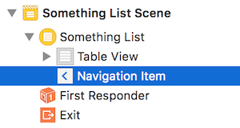
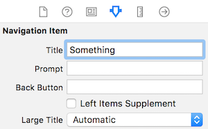

## How-to: New app with table view controller

Create a single view app.

In the project navigator, delete ("Move to Trash") the ViewController.swift file.

With the focus on the yellow project folder icon, create a new file (&#8984;+N).  

It will be a Cocoa Touch Class. Next, make it a subclass of UITableViewController.  

> Tip - Use the name "SomethingList" for the class name.  
> Leave out the words "table", "view" and "controller".

Show the Main.storyboard in the editor. Delete the view controller (scene). 

From the object library, add a new table view controller. Then:
* On its identity inspector, set its class to the just-created class from above
* Embed this controller in a navigation controller (use the Editor menu to do this)

Select the just-added navigation controller. On its attributes inspector, check (select/mark) the "Is Initial View Controller" checkbox.

On the document outline, in the table view controller hierarchy, select the "Navigation Item". 



On its attributes inspector, enter an approprate value for the Title property.



Next, select its table view cell object. On its attributes inspector, enter an appropriate value for the Identifier property (something short like "cell"). 

Open the just-added table view controller code in the editor. Locate the commented-out [`tableView(_:cellForRowAt:)`](https://developer.apple.com/documentation/uikit/uitableviewdatasource/1614861-tableview) method. Then: 
* Uncomment the method
* Replace the "reuseIdentifier" text with the value you entered above for the Identifier property 

At this point, the app should successfully build, and show an empty list. 

<br>

#### Test your progress

If you want the list to show one or more items (just to prove that it works), do the following, and then build-and-run:

1. In the `numberOfSections(in:)` method, return 1, instead of zero

2. In the `tableView(_:numberOfRowsInSection:)` method, return 1 (or more if you wish), instead of zero

3. In the `tableView(_:cellForRowAt:)` method, add a line of code to configure the cell's textLabel property...  
`cell.textLabel?.text = "Hello, world!"`

<br>

### Data for the table view, the basics

Almost always, the source of data for a table view is an array. 

The contents of the array can be simple `Int`s or `String`s, but most often the array elements will be objects that are based on a custom class. 

> For example,  
> Assume that we have a custom class for a "Product". Its source code is elsewhere (maybe in a `DomainClasses.swift` source code file.)  
> It will have properties for identifier, name, price, and probably some others.  
> A collection of Product objects - as an array - can be a data source for a table view.

In the *instance variables* declaration area of the class, declare an *empty* array of the desired data type. 

```swift
var products: [Product] = []
```

Then, in the `viewDidLoad()` method, load the array with data. While it is possible to write code that will create new objects from scratch and append each to the array, it would only be done for quick testing purposes. Instead, use the app's data model manager class(es) to fetch the data to be loaded into the array. 

<br>

### Data for the table view, from a model, example 1, singleton

In any app that has a modern design, a *data model manager* is responsible for managing the app's data for the benefit of ALL controllers in the app. It knows where the data is stored (in memory, and/or in persistent storage), and it has properties and methods for its supported data service operations (query, add, modify, etc.). 

There are two typical approaches to the use of a data model manager, from the perspective of a view controller: 
1. Get a reference to it from code that's in the view controller
2. Assume that it will be passed in (injected) into the view controller

In this "example 1, singleton" section, we write code in the controller that *calls out* to a data model manager. The manager is typically a [singleton](https://en.wikipedia.org/wiki/Singleton_pattern) (which is a "service" object that is created only once and stays accessible in memory). 

There are a few different ways to do this, and we show one typical way below. In this scenario, assume that we get a reference to the manager by reading/getting a property (which often includes the word "shared" in the property name):

```swift
// Create an instance variable
// Get a reference to the manager
let m = DataModelManager.sharedManager
```

Next, the manager will have one or more properties and/or methods that enable data service operations (fetch, add, change, etc.). For example, it may have a member (e.g. a method) that delivers a collection of products:

```swift
// In the viewDidLoad() method,
// fetch the products collection
// (into the already-created-above "products" instance variable)
products = m.productGetAll()
```

<br>

### Data for the table view, from a model, example 2, injected

In this "example 2, injected" section, we write code in the controller that *receives an injected* data model manager. The manager often behaves like a singleton, in that it is created only once when the app loads for the first time. However, a reference to it is passed to any new controller that needs it. 

There are a few different ways to do this, and we show one typical way below. First, in the controller, create an instance variable to hold a reference to the manager. For example:

```swift
// Create an instance variable to hold the manager
let m: DataModelManager!
```

Next, in the app delegate `application(_:didFinishLaunchingWithOptions:)` method, do the following. Note that it assumes that the *first* receiver of the manager is a table view controller.

```swift
// Create an instance of the model object
let m = DataModelManager()

// Get a reference to the navigation controller
let nav = window!.rootViewController as UINavigationController

// Get a reference to the (table view) controller
let tvc = nav.topViewController as SomethingList

// Pass the model object to the (table view) controller
tvc.m = m
```

Then, return to the `viewDidLoad()` method in the controller. As you did above, use the manager member (e.g. a method) that delivers a collection of products:

```swift
// In the viewDidLoad() method,
// fetch the products collection
// (into the already-created-above "products" instance variable)
products = m.productGetAll()
```

<br>

### Table view cell building in `tableView(_:cellForRowAt:)` 

The `tableView(_:cellForRowAt:)` method delivers a fully-configured UITableViewCell object to the iOS runtime. 

The runtime calls this method with a reference to the table view and an index path (section number and row number). Our job is to configure the cell. 

Make sure that the text string used for the cell identifier in this method matches the value used on the storyboard scene. 

Next, assuming that we have a one-section data model (and we do for most of our projects), use the index path "row" value to get the object from our data model (instance variable). Then, read what you want from the object's properties.

```swift
// Get the object we want
let item = Products[indexPath.row]

// Configure the UI objects
cell.textLabel?.text = item.ProductCode
cell.detailTextLabel?.text = item.Description
// etc.
```

That's how it's done. Best wishes.

<br>
