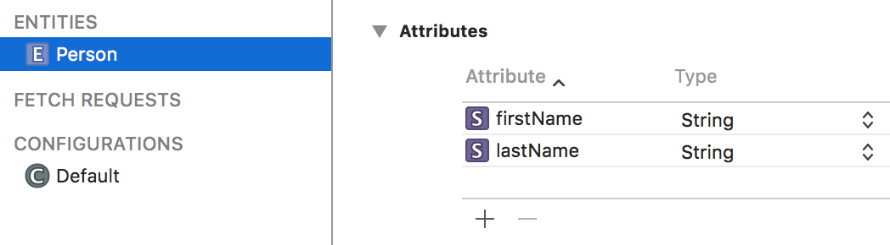

## Info: Core Data Introduction

Core Data is an object design, management, and persistence framework.

It enables you manage the lifecycle of objects and [object graphs](https://developer.apple.com/library/ios/Documentation/General/Conceptual/DevPedia-CocoaCore/ObjectGraph.html). The object graph can be simple (e.g. one entity object or collection), or it can be complex (e.g. many entity objects, some of which are related to others). 

In our apps, we are always using *objects* and *collections* of objects. Core Data enables us to focus on these programming constructs, without worrying about storage-related concerns. In our program code, we use (Swift) built-in language-based querying to do the typical data service operations (e.g. fetch, add, change, etc.). 

> The file format of Core Data on-device storage is essentially unimportant to us. While it is typically stored in a relational database management system (based on SQLite), we do not, can not, and must not think of Core Data as a database. Comparing and/or equating Core Data and relational database management system technologies *is a mistake*.

Designing a class in Swift, and designing an **entity** in Core Data model editor, are very similar.

A Person class in Swift might look like:
```swift
class Person {
    var firstName: String?
    var lastName: String?
}
```

Similarly, the Core Data model editor enables us to design an entity named "Person", and it would have two property attributes named "firstName" and "lastName", both of type String. Here's the editor in table view:



<br>

Here's the editor in graph view:


<br>

### How do I get started?

Use a *‘*project template*’*. In the course's GitHub repository, in the [Templates_and_solutions](https://github.com/dps923/fall2018/tree/master/Templates_and_solutions) folder, 
you will see a project named **TemplateCDv1**.

Make a copy of that, and you will have all you need to start working on a new project.

> How do I make a copy?  
> The Readme.txt file in the project helps you do this.

<br>

### Where do I go from here

Next, get the code example that's in the Week 10 folder of the repository. Look for a project named **CanadaTest**. It is essentially a Core Data version of the "Canada" (provinces and cities) programming assignment. Study all parts of that app. Use it, add data, notice its features and functionality. 

<br>

### Apple reference info

Apple publishes a [Core Data Programming Guide](https://developer.apple.com/library/archive/documentation/Cocoa/Conceptual/CoreData/index.html). While useful, essential, and authoritative, it does not include the advanced engineering that has been put into the template (above). As a result, when you're going through it, read critically, in the event that something it covers (e.g. "Initializing the Core Data Stack") sounds different that what you've learned recently. 

<br>
