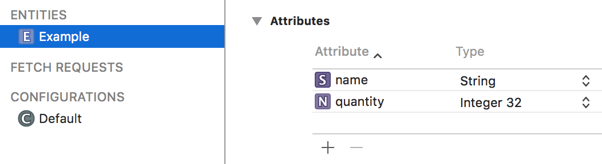

## Info: Project Template for Core Data projects

This document briefly introduces you to the new project template for projects that use the Core Data storage technology. It complements the in-class coverage from Monday November 12. 

The purpose of this document is to provide you with information. A separate "how to" document will show you how to use it for a new project. 

<br>

### Get the template

In the course's GitHub repository, in the [Templates_and_solutions](https://github.com/dps923/fall2018/tree/master/Templates_and_solutions) folder, 
you will see a project named **TemplateCDv1**.

Make a copy of that, and you will have all you need to start working on a new project.

> How do I make a copy?  
> The Readme.txt file in the project helps you do this.

<br>

### How to use the template

This topic is documented in a separate noted titled: 

[How-to: Template for Core Data](how-to-core-data-template)

<br>

### What is the design of the template

We have prepared a diagram that illustrates the design of the template. Click to open it full-size in its own tab/window:

<a href="/media/iOSAppObjectsWithCoreData2018v1.png" target="_blank"></a>

<br>

In the past month, we have been familiar with a simpler version of the diagram. This diagram includes the Core Data technology bits. The following explains the diagram and the code assets in the project template. Make sure you have both open when reviewing the following sections. 

<br>

### App delegate

> Black box, left-middle area of the diagram. 

As you know, the app delegate class is the app's entry/start point. It also has methods that handle system-wide events (e.g. an incoming voice phone call). 

As you have learned, it is the ideal place to initialize and prepare data for the app. That's what is happening here. 

It creates an instance of the data model manager class, and passes it along to the app's first active controller. 

<br>

### Data model manager 

> Red box, lower-middle area of the diagram. 

For many weeks, you have known that the role of the manager class is to centralize methods that do data service operations (fetch, add, change, etc.). That role remains the same. 

The make-up of the manager is influenced by the use of Core Data. It creates and manages something called the *Core Data stack*, which is the set of objects that implement Core Data. It also publishes the important "context" property, which is how all code - in the manager and in other controllers - use Core Data technology.

The manager's source code is actually split across two or more source code files. The base manager class is quite simple, with the "context" property, and methods for saving the context, and a "[factory](https://en.wikipedia.org/wiki/Factory_(object-oriented_programming))" for creating a *fetched results controller*. 

<br>

### Data model manager *extension* files 

As noted above, the manager's source code is split across files. Each additional file is a [Swift extension](https://docs.swift.org/swift-book/LanguageGuide/Extensions.html). The reason for this is to avoid having one huge (hundreds or thousands of lines of code) manager class, and to isolate per-entity methods in per-entity source code files. 

Notice that each extension begins with:

```swift
extension DataModelManager {
```

The extension includes methods that span the range of typical data service operations. A controller would get a reference to the manager when it initializes. Then, a controller would have access to ALL methods defined in the base "class" source code file, as well as in all the "extension" source code files. 

Study the methods in an extension. They should be understandable. (If not, ask.)

<br>

### Core Data stack

> Green box, lower-right area of the diagram. 

As noted above, the *Core Data stack* is the set of objects that implement Core Data for an app. 

The CDStack object is a set-it and forget-it object, in that it gets created when the app is loaded, and we just end up using its *context*. 

What is the context? Well, as explained in class and in the textbook, it represents a single “object space” or "temporary work area", or a "scratch pad" in an application. Its primary responsibility is to manage a collection of in-memory objects. When we are ready to save changes to persistent storage, we call the "save" method on the context. 

When we do a "fetch", the results are fetched from persistent storage, and are placed in memory in the context. Then, for example, we can display the results (on a list).  

We can also create a new object in the context. If we want to save the new object to persistent storage, we must save the context. 

Similarly, we can make changes to an object that is current fetched to the context. Again, we must save the context. 

<br>

### Store initializer

If we want an app to get to a user WITH some starter data, we can do that. One way is to programmatically create starter data in a class like the *store initializer*. 

Later in the course, we will learn other ways to create sizeable amounts of starter data, by importing data from a JSON file (for example), or fetching it from a web service. 

<br>

### Model classes, and Core Data model classes

> Red boxes, upper-middle-right area of the diagram. 

These classes describe the shape of data. For entities that are NOT part of the Core Data storage scheme, we create simple structs and/or classes to describe their shape. 

For Core Data managed entities, we use the Core Data model editor to define and design entities, their attributes, and relationships (if any). The editor works with a source code file that has an `xcdatamodeld` extension. Here is a definition for a simple entity named "Example":



<br>

The Core Data model editor *automatically generates* a class for each entity that we design. (The generated code is in a file that's in an area of the project that's reserved by the builder/compiler.) That enables us to use code like the following:

```swift
// Make an object, configure and save
if let newItem = m.example_CreateItem() {

  // newItem is a new object of type Example

  // We can now set the properties of this new object
  newItem.name = "Gizmo"
  newItem.quantity = 32
  m.ds_save()
}
```

<br>

### App workflow, user interface

> Blue box, top-right area of the diagram. 

Familiar controllers and storyboard scenes are in this area. 

The app delegate passes on a "manager" reference to the first active controller. Then, this reference *must* get passed on to *all other* controllers. 

"List" controllers (typically of type `UITableViewController`) use a *fetched results controller*, for which we use the initialism "frc". 

An frc is a wonderful and awesome object. [Among other features](https://developer.apple.com/documentation/coredata/nsfetchedresultscontroller), it efficently manages the results from a fetch request (see below for info about that), and organizes the results in a way that easily binds to the table view cells. It also automatically updates the list (table view cells) if/when data changes. 

The frc is usually configured in the `viewDidLoad()` method. 

One of the objects inside an frc is a *fetch request*. As [its name suggests](https://developer.apple.com/documentation/coredata/nsfetchrequest), it describes the search and delivery criteria used to fetch data. 

For example, we could fetch *all* "Product" objects. Or, we could fetch *some*, perhaps only those with a selling price greater than $40. Or, we could fetch *exactly one*, perhaps the "Product" with the unique identifier "123". The result set could be empty, or it could have one or more objects. 

> This kind of criterion is known as a *predicate*.  
> To us, a predicate looks like a string:  
> `attributeName == "foo"` 

For a result set with more than one object, you can choose to sort/sequence before delivery. 

> This kind of criterion is known as a *sort descriptor*.  
> To us, a sort descriptor is the name of an attribute, and a boolean value that determines ascending/descending delivery.  

<br>
