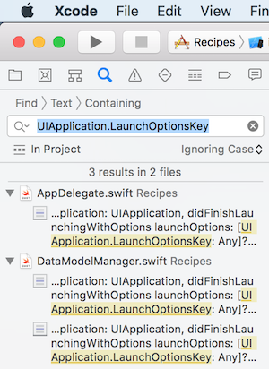
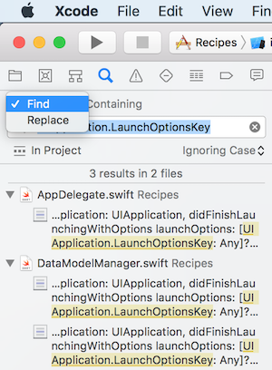
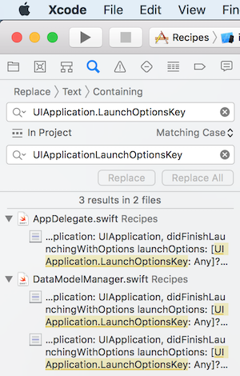

## Info: Code templates version 2

This document describes a version 1 code template that has standardized code for a multi-scene app. 

The app's data model is persisted in a Core Data store file set, in the [app sandbox](https://developer.apple.com/library/archive/documentation/FileManagement/Conceptual/FileSystemProgrammingGuide/FileSystemOverview/FileSystemOverview.html) directory, `Library/Application Support`. 

Students in Professor McIntyre's iOS programming course have permission to use, copy, and modify the code in this template. Yes, controllers etc. can be copied (added) to another project as-is and then modified to work in the other project. 

> Check this...  
> It may be possible to simply copy-paste the project folder  
> and rename the project 

Get it from the [course's code repository](https://github.com/dps923/fall2018). It is in the "Templates_and_solutions" folder. There is a convenient zip file for download use, and you can also use a browser to look at the code online.

 

### Features

The code in this template offers many features in various categories. 

General or overall features:
* Assumes a navigation-based app
* Includes one entity data model class (for a "product")
* Includes a data model manager class, and initialization code for the app delegate 
* Assumes data (and a reference to the manager) is passed on to successor controllers
* Most controllers initially assume the presence of a data model manager class and a "Product" class, and therefore have instance variables for them  

Controllers, workflow features included:
* Table view list controller, for use anywhere in a navigation workflow (start, middle, end) 
* Standard scene controller, for use anywhere in a navigation workflow

Controllers, task features included:
* "Detail" controller for modal use, the presenter will be the delegate
* "Add" controller for modal use, the presenter will be the delegate 
* "Edit" controller for modal use, the presenter will be the delegate 
* Combined "add and edit" controller for modal use, the presenter will be the delegate 
* These controllers include example user interface outlets, which you can use or remove to meet your project's needs
* All these task controllers include sample method implementations that can be copied to the presenter/delegate

 

### How-to-use info for students

This how-to info has been tested several times, in new projects, and in existing projects. When you use it, and you think that it needs a fix or an enhancement to work better, please contact your professor. Each controller is designed to have little or no error-generating impact when added to a project. 

Start by downloading or saving this project in a convenient location. 

In another project, use the project navigator, and select/focus on the yellow project folder. Then choose `Add files to "[project]"` (right-click, file menu, keyboard shortcut). 

Select the desired code module, and add it to the project. 

Each code module will need some edits to customize it to your project. Some references and objects may not exist because they're not (yet) in your project, so edit to fix (or comment out the offending statement). 

For the app's data model, add data model classes to meet your project's needs. Add methods to do data service operations (fetch, add, change, etc.) in the manager class. 

For each controller, change the source code file name to match the purpose in your project. Also, change the class name. 

Next, open it for editing. We will do a *find-replace*. This feature is found on the "Find" menu (and it has a keyboard shortcut, Option+Command+F). 

Turn on (activate) its case sensitivity option (the `Aa` control). It will be blue-colored when activated. 

You will typically do four separate find-replace tasks. For each click the "All" button/control do do the work:
1. Plurals, proper case - "Products" with the plural name of the entity
2. Plurals, lower case - "products" with the plural name of the entity
3. Singulars, proper case - "Product" with the singular name of the entity
4. Singulars, lower case - "product" with the singular name of the entity

Enjoy. 

### New info - the template is different for Xcode 9 and Xcode 10

In the Wednesday October 31 class, some students helped me locate a problem with the template. The problem is that it was created with Xcode version 10, which has a slightly different "iOS SDK" version. As a result, the base "Recipes" project will not compile correctly in Xcode 9. That version - Xcode 9 - is installed on all College Macs. 

I have updated the code repository. There are now two versions, one for Xcode 9 and another for Xcode 10. Sorry for any problems it may have caused. 

 

#### Fixing the problem

If you would prefer to fix the problem yourself, it can be done with a small number of find-replace actions:
* Replace `UIApplication.LaunchOptionsKey` with `UIApplicationLaunchOptionsKey` (no dot)
* Replace `UITableViewCell.EditingStyle` with `UITableViewCellEditingStyle` (no dot)
* replace `product.firstIndex` with `product.index` 

If you wish, you can use the "Find navigator". 

> Note - this is a slightly different version than the one you used on the "Find" menu, because the "Find navigator" will do find, and find-replace, on *all* files in the project. Nice and convenient.  

By default, it does "find". If you want to do "find-replace", there's a few extra steps involved. Here's an example:

Task | Image
--- | ---
Open the "Find navigator". Find one of the strings. It should show some results. |   
On the "Find > Text > Containing" bar, click on "Find", and then choose "Replace". It will show another entry field. |   
Change the "Ignoring Case" setting to "Matching Case". Notice that the "Replace All" button is greyed out and cannot be selected yet. |   
Put the cursor back into the top entry field, and press Enter. The results appear, and this time the "Replace All" button is clickable. Do that. |   

 
